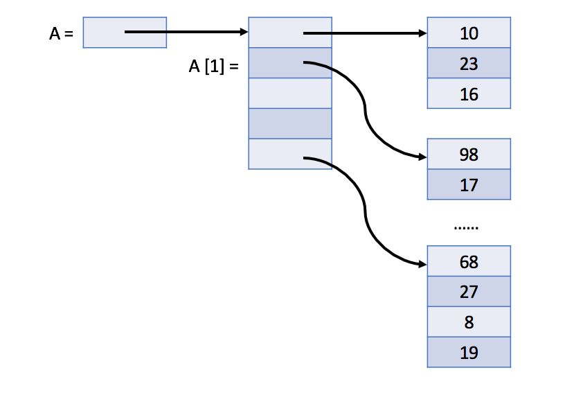

# Introduction to 2D Array

Bir o'lchovli massivga o'xshab, `ikki o'lchovli massiv` ham elementlar ketma-ketligidan iborat. Lekin elementlar chiziq emas, balki to'`rtburchaklar panjara` ichiga joylashtirilishi mumkin.

## An Example

Keling, ikki o'lchovli massivdan foydalanish misolini ko'rib chiqaylik:

```cpp
#include <iostream>

template <size_t n, size_t m>
void printArray(int (&a)[n][m]) {
    for (int i = 0; i < n; ++i) {
        for (int j = 0; j < m; ++j) {
            cout << a[i][j] << " ";
        }
        cout << endl;
    }
}

int main() {
    cout << "Example I:" << endl;
    int a[2][5];
    printArray(a);
    cout << "Example II:" << endl;
    int b[2][5] = {{1, 2, 3}};
    printArray(b);
    cout << "Example III:"<< endl;
    int c[][5] = {1, 2, 3, 4, 5, 6, 7};
    printArray(c);
    cout << "Example IV:" << endl;
    int d[][5] = {{1, 2, 3, 4}, {5, 6}, {7}};
    printArray(d);
}
```

[C++ Playground](https://leetcode.com/playground/RhanToxz)

## Principle:
Ba'zi tillarda ko'p o'lchovli massiv aslida `bir o'lchovli massiv sifatida ichki amalga oshiriladi`, ba'zi boshqa tillarda esa `ko'p o'lchovli massiv umuman yo'q`.

#### 1. C++ ikki o'lchovli massivni bir o'lchovli massiv sifatida saqlaydi.
Quyidagi rasmda M * N massiv A ning haqiqiy tuzilishi ko'rsatilgan:


Demak, A[i][j] A[i * N + j] ga teng bo'ladi, agar A ni bir o'lchovli massiv sifatida belgilagan bo'lsak, unda M * N elementlar ham mavjud.

#### 2. Java-da ikki o'lchovli massiv aslida bir o'lchovli massiv bo'lib, u M elementni o'z ichiga oladi, ularning har biri N butun sonli massivdir.

Quyidagi rasmda Java-da ikki o'lchovli A massivning haqiqiy tuzilishi ko'rsatilgan:



## Dynamic 2D Array

Bir o'lchovli dinamik massivga o'xshab, biz dinamik ikki o'lchovli massivni ham aniqlashimiz mumkin. Aslida, bu faqat o'rnatilgan dinamik massiv bo'lishi mumkin. Siz buni o'zingiz sinab ko'rishingiz mumkin.

© Leetcode [link](https://leetcode.com/explore/learn/card/array-and-string/202/introduction-to-2d-array/1166/)