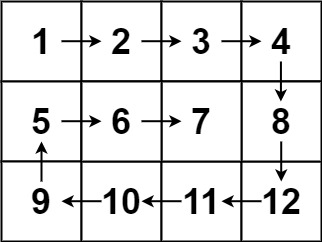

# Spiral Matrix

`m x n` matritsa mat berilgan bolsa, matritsaning barcha elementlarini spiral tartibda qaytaring..

#### Example 1:


```
Input: matrix = [[1,2,3],[4,5,6],[7,8,9]]
Output: [1,2,3,6,9,8,7,4,5]
```

#### Example 2:



```
Input: matrix = [[1,2,3,4],[5,6,7,8],[9,10,11,12]]
Output: [1,2,3,4,8,12,11,10,9,5,6,7]
```

#### Cheklovlar:

* `m == matrix.length`
* `n == matrix[i].length`
* `1 <= m, n <= 10`
* `-100 <= matrix[i][j] <= 100`

> Hint-1: 
> 
> Ba'zi muammolar uchun eng yaxshi yo'l simulyatsiya uchun ba'zi algoritmlarni ishlab chiqishdir. Asosan, muammo bizdan nima qilishni talab qilayotganini taqlid qilishingiz kerak.

> Hint-2:
>
> Biz chegara bo'ylab chegaradan o'tamiz va ichkariga harakat qilamiz. Bu asosiy operatsiya. Birinchi qator, oxirgi ustun, oxirgi qator, birinchi ustun, keyin esa 1 ga ichkariga o'tamiz va takrorlaymiz. Ana xolos. Bu bizga kerak bo'lgan barcha simulyatsiya.

> Hint-3: 
>
> Indekslardan birida taraqqiyotni qachon o'zgartirmoqchi ekanligingizni o'ylab ko'ring. Agar [i, j] dan i ga o'tsangiz, xuddi shu ustunga o'tasiz. Xuddi shunday, j uchun qiymatlarni o'zgartirish orqali siz bir xil qatorga o'tasiz. Shuningdek, chegaraning oxirini kuzatib boring, shunda siz ichkariga qarab harakat qilishingiz va keyin takrorlashni davom ettirasiz. Bitta ustun yoki bitta qator kabi chekka holatlarni taqlid qilish har doim eng yaxshisidir.

```go
func spiralOrder(matrix [][]int) []int {
	m := len(matrix)
	n := len(matrix[0])

	res := make([]int, m*n)

	l, r, t, b := 0, n-1, 0, m-1

	for i := 0; i < m*n; {

		// left to rigth step
		for j := l; j <= r; j++ {
			res[i] = matrix[t][j]
			i++
		}
		t++

		if t > b {
			break
		}

		// top to bottom step
		for j := t; j <= b; j++ {
			res[i] = matrix[j][r]
			i++
		}
		r--

		if l > r {
			break
		}

		// right to left step
		for j := r; j >= l; j-- {
			res[i] = matrix[b][j]
			i++
		}
		b--

		// bottom to top step
		for j := b; j >= t; j-- {
			res[i] = matrix[j][l]
			i++
		}
		l++
	}

	return res
}
```
© Leetcode [link](https://leetcode.com/explore/learn/card/array-and-string/202/introduction-to-2d-array/1168/)