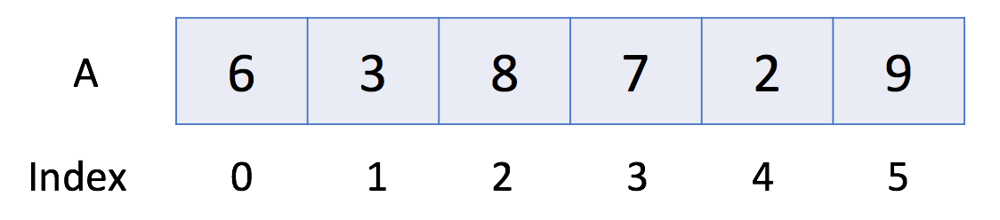

# Introduction to Array

`Massiv` - `elementlar to'plamini ketma-ket saqlash` uchun asosiy ma'lumotlar tuzilmasi. Ammo elementlarga `tasodifiy kirish mumkin`, chunki massivdagi har bir elementni massiv `indeksi` orqali aniqlash mumkin.

Massiv bir yoki bir nechta o'lchamga ega bo'lishi mumkin. Bu erda biz chiziqli massiv deb ham ataladigan `bir o'lchovli massiv`dan boshlaymiz. Mana bir misol:



Yuqoridagi misolda A massivida 6 ta element mavjud. Ya'ni, A ning uzunligi 6 ga teng. Massivdagi birinchi elementni ko'rsatish uchun A[0] dan foydalanishimiz mumkin. Shuning uchun, A[0] = 6. Xuddi shunday, A[1] = 3, A[2] = 8 va hokazo.

## Operations in Array

Keling, massivdan foydalanishni ko'rib chiqaylik.

```cpp
#include <iostream>

int main() {
    // 1. Initialize
    int a0[5];
    int a1[5] = {1, 2, 3};  // other element will be set as the default value
    // 2. Get Length
    int size = sizeof(a1) / sizeof(*a1);
    cout << "The size of a1 is: " << size << endl;
    // 3. Access Element
    cout << "The first element is: " << a1[0] << endl;
    // 4. Iterate all Elements
    cout << "[Version 1] The contents of a1 are:";
    for (int i = 0; i < size; ++i) {
        cout << " " << a1[i];
    }
    cout << endl;
    cout << "[Version 2] The contents of a1 are:";
    for (int& item: a1) {
        cout << " " << item;
    }
    cout << endl;
    // 5. Modify Element
    a1[0] = 4;
    // 6. Sort
    sort(a1, a1 + size);
}
```

[C++ Playground](https://leetcode.com/playground/V4r5YpoS)

```go
package main

import "fmt"

func main(){

    // 1. Initialize
    var a0 [5]int
    fmt.Println(a0)

    a1 := [5]int{1, 2, 3}
    fmt.Println(a1)

    a2 := [...]int{1, 2, 3, 4, 5}
    fmt.Println(a2)

    a3 := [5]int{2: 100, 4: 200} // use index
    fmt.Println(a3)

    // 2. Get Length
    fmt.Println("The length of a3 is", len(a3))

    // 3. Access Element
    fmt.Println("The first element is", a1[0])

    // 4. Iterate all Elements
    fmt.Println("The contents of a3 are")
    for i := 0; i < len(a3); i++ {
        fmt.Println(a3[i])
    }
    fmt.Println("The contents of a3 are")
    for idx, item := range a3 {
        fmt.Println(idx, item)
    }

    // 5. Modify Element
    a1[0] = 4

    // 6. Sort
    sort.Ints(a1[:])
}

```

[Go Playground](https://go.dev/play/p/4GJbAk3JUD6)


© Leetcode [link](https://leetcode.com/explore/learn/card/array-and-string/201/introduction-to-array/1143/)
