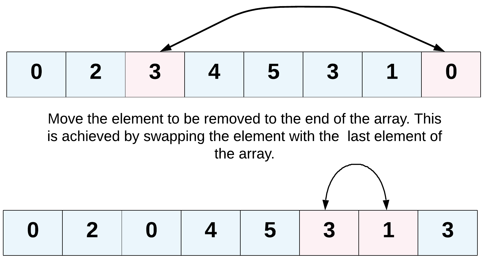

# Remove Element

Butun massiv `nums` va butun son `val` berilgan boʻlsa, o'z o'rnida `nums`dagi `val`ning barcha holatlarini olib tashlang. Elementlarning tartibi o'zgarishi mumkin. Keyin *`val` ga teng bo'lmagan `nums` elementlar sonini* qaytaring.

`Val` `k` ga teng bo'lmagan `nums`dagi elementlar sonini ko'rib chiqing, qabul qilish uchun siz quyidagi amallarni bajarishingiz kerak:
* `nums` massiv raqamlarini shunday o'zgartiringki, `nums`ning birinchi `k` elementi `val` ga teng bo'lmagan elementlarni o'z ichiga oladi. `nums`ning qolgan elementlari `nums`ning kattaligi kabi muhim emas.
* `k` ni qaytaring.

## Maxsus hakam:

Sudya sizning yechimingizni quyidagi kod bilan sinab ko'radi:
```python
int[] nums = [...]; // Input array
int val = ...; // Value to remove
int[] expectedNums = [...]; // The expected answer with correct length.
                            // It is sorted with no values equaling val.

int k = removeElement(nums, val); // Calls your implementation

assert k == expectedNums.length;
sort(nums, 0, k); // Sort the first k elements of nums
for (int i = 0; i < actualLength; i++) {
    assert nums[i] == expectedNums[i];
}
```
Agar barcha tasdiqlar o'tib ketsa, sizning yechimingiz qabul qilinadi .

#### Example 1:
```
Input: nums = [3,2,2,3], val = 3
Output: 2, nums = [2,2,_,_]
Explanation: Sizning funktsiyangiz k = 2 ni qaytarishi kerak, sonlarning birinchi ikkita elementi 2 ga teng. Qaytarilgan k dan keyin nima qoldirganingiz muhim emas (shuning uchun ular pastki chiziq).
```

#### Example 2:
```
Input: nums = [0,1,2,2,3,0,4,2], val = 2
Output: 5, nums = [0,1,4,0,3,_,_,_]
Explanation: Sizning funktsiyangiz 0, 0, 1, 3 va 4 ni o'z ichiga olgan raqamlarning birinchi besh elementi bilan k = 5 ni qaytarishi kerak. Besh elementni istalgan tartibda qaytarish mumkinligini unutmang. \
Qaytarilgan k dan keyin nima qoldirganingiz muhim emas (shuning uchun ular pastki chiziq).
```

#### Cheklovlar:

* `0 <= nums.length <= 100`
* `0 <= nums[i] <= 50`
* `0 <= val <= 100`

> Hint-1
>
> Muammo bayonoti bizdan massivni joyida o'zgartirishimizni aniq so'raydi va shuningdek, massivning yangi uzunligidan tashqaridagi element har qanday bo'lishi mumkinligini aytadi. Element berilgan bo'lsa, biz uning barcha hodisalarini massivdan olib tashlashimiz kerak. Texnik jihatdan bu elementni har bir deyish uchun olib tashlashimiz shart emas, to'g'rimi?

> Hint-2
>
> Ushbu elementning barcha hodisalarini massiv oxiriga ko'chirishimiz mumkin. Ikkita ko'rsatkichdan foydalaning!
> 

> Hint-3
>
> Fikrning yana bir yo'nalishi - olib tashlanadigan elementlarni mavjud emas deb hisoblashdir. Bitta o'tishda, agar biz ko'rinadigan elementlarni joyida nusxalashni davom ettirsak, bu biz uchun ham bu muammoni hal qilishi kerak.


```go
func removeElement(nums []int, val int) int {
    k := 0
    for i := 0; i < len(nums); i++ {
        if nums[i] != val {
            nums[k]=nums[i]
            k++
        }
    }

    return k
}
```

© Leetcode [link](https://leetcode.com/explore/learn/card/array-and-string/205/array-two-pointer-technique/1151/)