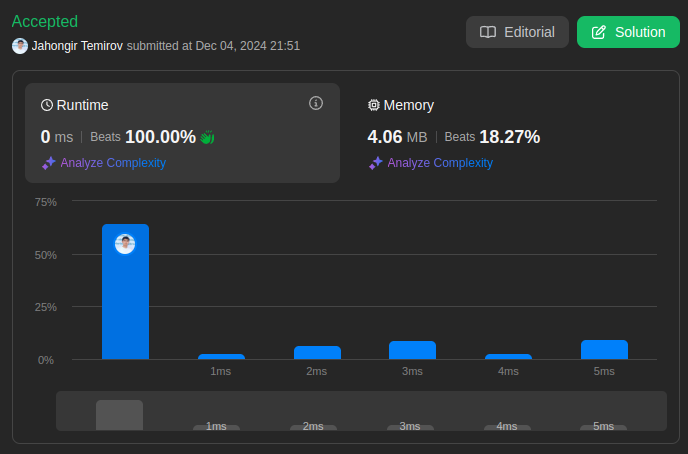

# 7. Reverse Integer

🟧 Medium

Given a signed 32-bit integer `x`, return `x` *with its digits reversed*. If reversing `x` causes the value to go outside the signed 32-bit integer range `[-2^31, 2^31 - 1]`, then return `0`.

**Assume the environment does not allow you to store 64-bit integers (signed or unsigned).**

## Example 1

> **Input**: x = 123 \
> **Output**: 321

## Example 2

> **Input**: x = -123 \
> **Output**: -321

## Example 3

> **Input**: x = 120 \
> **Output**: 21

## Constraints

* `-2^31 <= x <= 2^31-1`

## Solution

My Solution (Basic Reversal)

```go
func reverse(x int) int {
    isNegative := false

    if x < 0 {
        isNegative = true
        x *= -1
    }

    num := 0

    for x != 0 {
        num *= 10
        num += x%10
        x /= 10
    }

    if isNegative {
        num *= -1
    }

    if math.MinInt32 <= num && num <= math.MaxInt32 {
        return num
    }
    
    return 0
}
```

Optimal Solution (Overflow Prevention)

```go
func reverse(x int) int {
    result := 0
    
    for x != 0 {
        // Get last digit
        pop := x % 10
        x /= 10
        
        // Check overflow before updating result
        if result > math.MaxInt32/10 || (result == math.MaxInt32/10 && pop > 7) {
            return 0
        }
        if result < math.MinInt32/10 || (result == math.MinInt32/10 && pop < -8) {
            return 0
        }
        
        result = result*10 + pop
    }
    
    return result
}
```

### Approach Analysis

This problem combines digit manipulation with careful overflow handling:

1. Basic Reversal (Your Solution):
   * Handle negative numbers separately
   * Build reversed number digit by digit
   * Check overflow at the end
   * Simple but may have edge cases

2. Overflow Prevention (Optimal):
   * Check overflow before each operation
   * Handle signs within main logic
   * More robust for edge cases
   * No extra space needed

### Visualization of Both Approaches

#### Basic Reversal Process (Your Solution)

```text
Input: x = 123

Step 1: Extract digits
123 → digit = 3, x = 12
12  → digit = 2, x = 1
1   → digit = 1, x = 0

Step 2: Build result
0    → 0*10 + 3 = 3
3    → 3*10 + 2 = 32
32   → 32*10 + 1 = 321
```

#### Overflow Prevention Process

```text
Input: x = 1463847412

Before each step, check:
- Is result > MaxInt32/10? (214748364)
- If result = MaxInt32/10, is digit > 7?

Step 1: 1463847412 → result = 2
Step 2: 146384741  → result = 21
...
Step N: Check prevents overflow
```

### Complexity Analysis

#### Basic Reversal (Your Solution)

* Time: O(log₁₀|x|)
  * Process each digit once
  * Number of digits = log₁₀|x|
  * Simple arithmetic operations

* Space: O(1)
  * Only use few variables
  * Constant extra space
  * No additional data structures

#### Overflow Prevention (Optimal)

* Time: O(log₁₀|x|)
  * Same as basic solution
  * Extra overflow checks are O(1)
  * Still process each digit once

* Space: O(1)
  * Only use result variable
  * Constant extra space
  * No temporary storage needed

### Why Overflow Prevention Works

1. Mathematical Foundation:
   * MaxInt32 = 2147483647
   * MinInt32 = -2147483648
   * Last digits are 7 and -8
   * Division by 10 preserves sign

2. Early Detection:
   * Check before multiplication
   * Prevents any overflow
   * Handles all edge cases
   * No need for 64-bit integers

### When to Use Each Approach

1. Basic Reversal When:
   * Learning number manipulation
   * Quick implementation needed
   * Input range is known safe
   * Code clarity is priority

2. Overflow Prevention When:
   * Production environment
   * Unknown input range
   * Performance critical
   * Memory constraints

### Common Patterns & Applications

1. Related Problems:
   * String to Integer (atoi)
   * Palindrome Number
   * Add Two Numbers
   * Multiply Strings

2. Key Techniques:
   * Digit extraction
   * Overflow checking
   * Sign handling
   * Modular arithmetic

### Interview Tips

1. Solution Highlights:
   * Handle signs properly
   * Check overflow early
   * Process digits efficiently
   * Consider all edge cases

2. Common Pitfalls:
   * Missing overflow check
   * Wrong sign handling
   * Integer division issues
   * Boundary conditions

3. Testing Strategy:
   * Positive numbers
   * Negative numbers
   * Zero
   * Maximum integers
   * Minimum integers

4. Follow-up Questions:
   * Handle decimal points?
   * Different base numbers?
   * Stream of digits?
   * Memory optimization?



Leetcode: [link](https://leetcode.com/problems/reverse-integer/description/)
