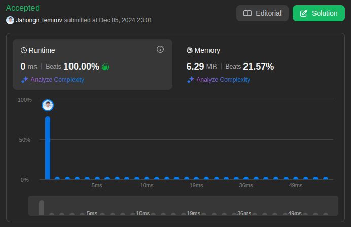

# 26. Remove Duplicates from Sorted Array

🟩 Easy

Given an integer array `nums` sorted in **non-decreasing order**, remove the duplicates **in-place** such that each unique element appears only **once**. The **relative order** of the elements should be kept the **same**. Then return *the number of unique elements in* `nums`.

Consider the number of unique elements of `nums` to be `k`, to get accepted, you need to do the following things:

* Change the array nums such that the first `k` elements of `nums` contain the unique elements in the order they were present in `nums` initially. The remaining elements of `nums` are not important as well as the size of `nums`.
* Return `k`.

## Custom Judge

The judge will test your solution with the following code:

```text
int[] nums = [...]; // Input array
int[] expectedNums = [...]; // The expected answer with correct length

int k = removeDuplicates(nums); // Calls your implementation

assert k == expectedNums.length;
for (int i = 0; i < k; i++) {
    assert nums[i] == expectedNums[i];
}
```

If all assertions pass, then your solution will be **accepted**.

## Example 1

> **Input**: nums = [1,1,2] \
> **Output**: 2, nums = [1,2,*] \
> **Explanation**: Your function should return k = 2, with the first two elements of nums being 1 and 2 respectively. \
> It does not matter what you leave beyond the returned k (hence they are underscores).

## Example 2

> **Input**: nums = [0,0,1,1,1,2,2,3,3,4] \
> **Output**: 5, nums = [0,1,2,3,4,*,*,*,*,*,*,*] \
> **Explanation**: Your function should return k = 5, with the first five elements of nums being 0, 1, 2, 3, and 4 respectively. \
> It does not matter what you leave beyond the returned k (hence they are underscores).

## Constraints

* `1 <= nums.length <= 3 * 10^4`
* `-100 <= nums[i] <= 100`
* `nums` is sorted in **non-decreasing** order.

## Hint-1

> In this problem, the key point to focus on is the input array being sorted. As far as duplicate elements are concerned, what is their positioning in the array when the given array is sorted? Look at the image above for the answer. If we know the position of one of the elements, do we also know the positioning of all the duplicate elements?
> 

## Hint-2

> We need to modify the array in-place and the size of the final array would potentially be smaller than the size of the input array. So, we ought to use a two-pointer approach here. One, that would keep track of the current element in the original array and another one for just the unique elements.

## Hint-3

> Essentially, once an element is encountered, you simply need to **bypass** its duplicates and move on to the next unique element.

## Solution

My Solution (Two Pointers)

```go
func removeDuplicates(nums []int) int {
    idx := 1

    for i := 1; i < len(nums); i++ {
        if nums[idx-1] != nums[i] {
            nums[idx] = nums[i]
            idx++
        }
    }

    return idx
}
```

Optimal Solution 1 (Fast-Slow Pointers)

```go
func removeDuplicates(nums []int) int {
    if len(nums) == 0 {
        return 0
    }
    
    slow := 0
    
    for fast := 1; fast < len(nums); fast++ {
        if nums[fast] != nums[slow] {
            slow++
            nums[slow] = nums[fast]
        }
    }
    
    return slow + 1
}
```

Optimal Solution 2 (Window Sliding)

```go
func removeDuplicates(nums []int) int {
    n := len(nums)
    if n <= 1 {
        return n
    }
    
    writePos := 1
    lastUnique := nums[0]
    
    for readPos := 1; readPos < n; readPos++ {
        if nums[readPos] > lastUnique {
            lastUnique = nums[readPos]
            nums[writePos] = nums[readPos]
            writePos++
        }
    }
    
    return writePos
}
```

### Approach Analysis

This problem demonstrates different in-place modification techniques:

1. Two Pointers (Your Solution):
   * Track write position
   * Compare with previous
   * In-place modification
   * Efficient scanning

2. Fast-Slow Pointers:
   * Slow tracks unique elements
   * Fast scans array
   * Similar to merge logic
   * Clear separation of roles

3. Window Sliding:
   * Track last unique value
   * Write position management
   * Explicit value comparison
   * Boundary handling

### Visualization of Approaches

#### Two Pointers Process (Your Solution)

```text
Input: [0,0,1,1,1,2,2,3,3,4]

Step 1: [0|0,1,1,1,2,2,3,3,4]  idx=1
Step 2: [0,1|1,1,2,2,3,3,4]    idx=2
Step 3: [0,1,2|2,3,3,4]        idx=3
Step 4: [0,1,2,3|3,4]          idx=4
Step 5: [0,1,2,3,4|_,_,_,_,_]  idx=5

Return: 5
```

#### Fast-Slow Pointers Process

```text
Input: [0,0,1,1,1,2,2,3,3,4]

slow=0, fast=1: [0|0,1,1,1,2,2,3,3,4]
slow=1, fast=2: [0,1|1,1,2,2,3,3,4]
slow=2, fast=5: [0,1,2|2,3,3,4]
slow=3, fast=7: [0,1,2,3|3,4]
slow=4, fast=9: [0,1,2,3,4|_,_,_,_,_]

Return: 5
```

#### Window Sliding Process

```text
Input: [0,0,1,1,1,2,2,3,3,4]

lastUnique=0: [0|0,1,1,1,2,2,3,3,4]
lastUnique=1: [0,1|1,1,2,2,3,3,4]
lastUnique=2: [0,1,2|2,3,3,4]
lastUnique=3: [0,1,2,3|3,4]
lastUnique=4: [0,1,2,3,4|_,_,_,_,_]

Return: 5
```

### Complexity Analysis

#### Two Pointers Solution (Your Solution)

* Time: O(n)
  * Single pass through array
  * Sequential access
  * No extra iterations

* Space: O(1)
  * In-place modification
  * Only two pointers
  * No extra storage

#### Fast-Slow Pointers Solution

* Time: O(n)
  * Linear scan
  * One-pass algorithm
  * No backtracking

* Space: O(1)
  * Two pointers only
  * In-place swaps
  * Constant space

#### Window Sliding Solution

* Time: O(n)
  * Single traversal
  * Linear time
  * Value tracking

* Space: O(1)
  * Fixed variables
  * No extra array
  * In-place updates

### Why Solutions Work

1. Two Pointers Logic:
   * Sorted array property
   * Sequential comparison
   * In-place modification
   * Order preservation

2. Fast-Slow Properties:
   * Slow tracks unique
   * Fast finds new elements
   * Natural partitioning
   * Automatic spacing

3. Window Sliding:
   * Track unique values
   * Write position control
   * Sorted nature usage
   * Boundary handling

### When to Use

1. Two Pointers When:
   * Array is sorted
   * In-place modification
   * Order matters
   * Simple logic needed

2. Fast-Slow When:
   * Need clear separation
   * Partition required
   * Merge-like operation
   * Two-speed processing

3. Window Sliding When:
   * Value tracking needed
   * Write position critical
   * Clear boundaries
   * Sequential access

### Common Patterns & Applications

1. Related Problems:
   * Remove Element
   * Move Zeroes
   * Remove Duplicates II
   * Merge Sorted Array

2. Key Techniques:
   * Two pointers
   * In-place modification
   * Order preservation
   * Boundary handling

### Interview Tips

1. Solution Highlights:
   * In-place modification
   * Space efficiency
   * Order preservation
   * Edge cases

2. Common Pitfalls:
   * Array bounds
   * Duplicate handling
   * Return value
   * Order preservation

3. Testing Strategy:
   * Empty array
   * Single element
   * All duplicates
   * No duplicates
   * Maximum duplicates

4. Follow-up Questions:
   * What if not sorted?
   * Multiple duplicates?
   * Stability required?
   * Memory constraints?



Leetcode: [link](https://leetcode.com/problems/remove-duplicates-from-sorted-array/description/)
