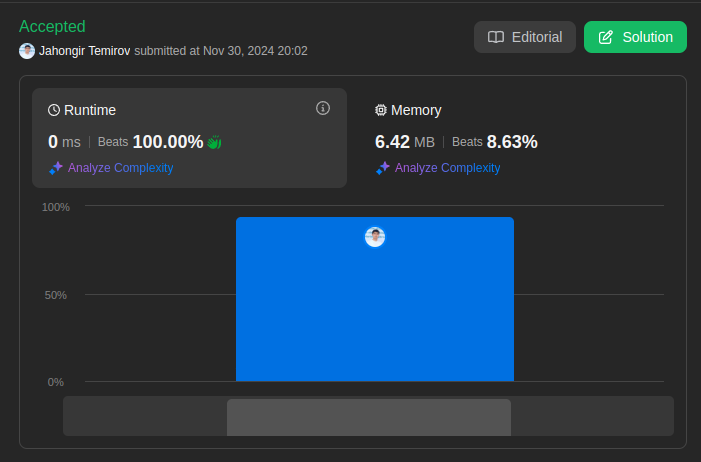

# 104. Maximum Depth of Binary Tree

🟩 Easy

Given the `root` of a binary tree, return its maximum depth.

A binary tree's **maximum depth** is the number of nodes along the longest path from the root node down to the farthest leaf node.

## Example 1


> **Input**: root = [3,9,20,null,null,15,7] \
> **Output**: 3

## Example 2

> **Input**: root = [1,null,2] \
> **Output**: 2

## Constraints

* The number of nodes in the tree is in the range `[0, 10^4]`.
* `-100 <= Node.val <= 100`

## Solution

My Solution

```go
func maxDepth(root *TreeNode) int {
    if root == nil {
        return 0
    }

    if root.Left == nil && root.Right == nil {
        return 1
    }

    if root.Left == nil {
        return maxDepth(root.Right) + 1
    }

    if root.Right == nil {
        return maxDepth(root.Left) + 1
    }

    return max(maxDepth(root.Right), maxDepth(root.Left))+1
}
```

Optimal Solution (Concise DFS)

```go
func maxDepth(root *TreeNode) int {
    if root == nil {
        return 0
    }
    return 1 + max(maxDepth(root.Left), maxDepth(root.Right))
}
```

Alternative Solution (Iterative BFS)

```go
func maxDepth(root *TreeNode) int {
    if root == nil {
        return 0
    }
    
    depth := 0
    queue := []*TreeNode{root}
    
    for len(queue) > 0 {
        levelSize := len(queue)
        depth++
        
        // Process all nodes at current level
        for i := 0; i < levelSize; i++ {
            node := queue[0]
            queue = queue[1:]
            
            if node.Left != nil {
                queue = append(queue, node.Left)
            }
            if node.Right != nil {
                queue = append(queue, node.Right)
            }
        }
    }
    
    return depth
}
```

### Approach Analysis

This problem can be solved in multiple ways:

1. Your Solution (Explicit DFS):
   * Handles each case separately
   * Very clear and readable
   * Explicitly checks for leaf and single-child cases
   * Good for understanding the problem

2. Optimal DFS Solution:
   * More concise implementation
   * Implicitly handles all cases
   * Same time/space complexity
   * Relies on max function elegantly

3. BFS Alternative:
   * Level-order traversal
   * Counts depth level by level
   * Uses queue data structure
   * Good for level-based operations

### Complexity Analysis

#### Time Complexity: O(n)

* All solutions visit each node exactly once
* Constant work per node
* n is total number of nodes

#### Space Complexity

* DFS Solutions: O(h)
  * h is height of tree
  * Recursive call stack
  * Best: O(log n) for balanced
  * Worst: O(n) for skewed

* BFS Solution: O(w)
  * w is maximum width of tree
  * Queue size at widest level
  * Best: O(1) for skewed
  * Worst: O(n/2) for perfect binary tree

### Why Different Approaches Work

* Your Solution:
  * Explicit case handling
  * Clear logic flow
  * Good for debugging
  * Easy to modify for variations

* Optimal DFS:
  * Mathematical elegance
  * Recursive subproblem
  * Minimal code
  * Same efficiency

* BFS Approach:
  * Natural level counting
  * No recursion needed
  * Easy to modify for related problems
  * Good for level-specific tasks

### Common Patterns & Applications

* Similar Problems:
  * Minimum Depth of Binary Tree
  * Balanced Binary Tree
  * Diameter of Binary Tree

* Tree Traversal Patterns:
  * DFS: Pre/In/Post order
  * BFS: Level order
  * Each has its use cases

* When to Use Each:
  * DFS: Path-related problems
  * BFS: Level-related problems
  * Your solution: When clarity is priority
  * Optimal: When conciseness matters



Leetcode: [link](https://leetcode.com/problems/maximum-depth-of-binary-tree/description/)
