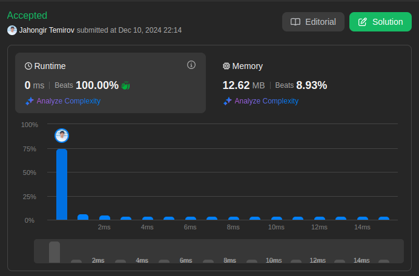

# 121. Best Time to Buy and Sell Stock

🟩 Easy

You are given an array `prices` where `prices[i]` is the price of a given stock on the `i^th` day.

You want to maximize your profit by choosing a **single day** to buy one stock and choosing a **different day in the future** to sell that stock.

Return *the maximum profit you can achieve from this transaction*. If you cannot achieve any profit, return `0`.

## Example 1

> **Input**: prices = [7,1,5,3,6,4] \
> **Output**: 5 \
> **Explanation**: Buy on day 2 (price = 1) and sell on day 5 (price = 6), profit = 6-1 = 5. \
Note that buying on day 2 and selling on day 1 is not allowed because you must buy before you sell.

## Example 2

> **Input**: prices = [7,6,4,3,1] \
> **Output**: 0 \
> **Explanation**: In this case, no transactions are done and the max profit = 0.

## Constraints

* `1 <= prices.length <= 10^5`
* `0 <= prices[i] <= 10^4`

## Solution

My Solution

```go
func maxProfit(prices []int) int {
    max, min := 0, prices[0]
    for i := 1; i < len(prices); i++ {
        if prices[i] < min {
            min = prices[i]
        } else if (prices[i] - min) > max {
            max = prices[i] - min
        }
    }

    return max
}
```

## Optimal Solution

The optimal solution uses Kadane's algorithm concept with a single pass:

```go
func maxProfit(prices []int) int {
    if len(prices) < 2 {
        return 0
    }
    
    minPrice := prices[0]   // Track minimum price seen so far
    maxProfit := 0         // Track maximum profit possible
    
    for i := 1; i < len(prices); i++ {
        // Update minimum price if current price is lower
        if prices[i] < minPrice {
            minPrice = prices[i]
        }
        
        // Calculate potential profit and update max if higher
        currentProfit := prices[i] - minPrice
        if currentProfit > maxProfit {
            maxProfit = currentProfit
        }
    }
    
    return maxProfit
}
```

### Approach Analysis

The solution uses two key techniques:

1. **Minimum Price Tracking**:
   * Keep track of lowest price seen so far
   * Update minimum when lower price found
   * Serves as potential buying point

2. **Maximum Profit Calculation**:
   * Calculate profit with current price
   * Compare with maximum profit seen
   * Update if new profit is higher

### Visualization of Both Approaches

```text
Input: [7,1,5,3,6,4]

Step-by-Step Process:

Day 1: price = 7
minPrice = 7
maxProfit = 0

Day 2: price = 1
minPrice = 1 (updated)
maxProfit = 0

Day 3: price = 5
minPrice = 1
maxProfit = 4 (5-1)

Day 4: price = 3
minPrice = 1
maxProfit = 4 (no change)

Day 5: price = 6
minPrice = 1
maxProfit = 5 (6-1)

Day 6: price = 4
minPrice = 1
maxProfit = 5 (no change)

Final Result: 5
```

### Complexity Analysis

**Time Complexity**:

* O(n) - single pass through the array
* Each element processed exactly once
* Constant time operations per element

**Space Complexity**:

* O(1) - only two variables used
* No extra space needed
* Input array not modified

**Optimizations**:

* Early return for small arrays
* No extra data structures needed
* In-place calculation

### Why Solution Works

1. **Greedy Approach**:
   * Always buy at lowest price seen
   * Calculate profit with every price
   * Keep track of maximum profit

2. **Single Pass Efficiency**:
   * No need to compare all pairs
   * Maintains minimum price state
   * Updates profit opportunistically

3. **State Maintenance**:
   * minPrice tracks best buying opportunity
   * maxProfit tracks best selling opportunity
   * Both updated optimally

### When to Use

This approach is ideal when:

1. Need to find maximum difference
2. Future values can be considered
3. Single pass solution required
4. Memory usage must be minimal

Common applications:

* Stock price analysis
* Maximum difference problems
* Time series analysis
* Peak-valley problems

### Common Patterns & Applications

1. **Kadane's Algorithm Variation**:
   * Track minimum value
   * Calculate current difference
   * Update maximum difference

2. **Valley-Peak Pattern**:
   * Find lowest valley
   * Find highest peak after valley
   * Calculate maximum difference

3. **State Tracking**:
   * Maintain minimum state
   * Update maximum result
   * Single pass processing

### Interview Tips

1. **Initial Clarification**:
   * Confirm if multiple transactions allowed
   * Ask about handling empty/small arrays
   * Clarify if negative prices possible
   * Discuss time/space constraints

2. **Solution Walkthrough**:
   * Start with brute force approach
   * Explain optimization to single pass
   * Discuss why we track minimum price
   * Show how profit is maximized

3. **Code Implementation Strategy**:
   * Begin with input validation
   * Initialize tracking variables
   * Implement main loop logic
   * Handle edge cases

4. **Optimization Discussion**:
   * Single pass vs nested loops
   * Space optimization (O(1))
   * Early termination possibilities
   * Error handling

5. **Common Pitfalls to Avoid**:
   * Buying after selling
   * Not handling edge cases
   * Integer overflow for large prices
   * Unnecessary comparisons

6. **Follow-up Questions**:
   * Q: "How would you handle multiple transactions?"
     A: Use dynamic programming with state transitions

   * Q: "What if we need to return the buy/sell days?"
     A: Track indices along with prices

   * Q: "How to handle negative prices?"
     A: Add validation or adjust algorithm accordingly

   * Q: "Can we optimize for specific price patterns?"
     A: Yes, by adding pattern recognition logic

7. **Edge Cases to Test**:
   * Empty array: return 0
   * Single price: return 0
   * Decreasing prices: return 0
   * Equal prices: return 0
   * Large price differences

8. **Code Quality Points**:
   * Clear variable names
   * Early return optimization
   * Clean loop logic
   * Proper error handling

9. **Alternative Approaches**:
   * Two pointers technique
   * Dynamic programming
   * Divide and conquer
   * Stack-based solution

10. **Performance Analysis**:
    * Best case: O(n)
    * Worst case: O(n)
    * Memory: O(1)
    * No performance degradation with input size



Leetcode: [link](https://leetcode.com/problems/best-time-to-buy-and-sell-stock/description/)
