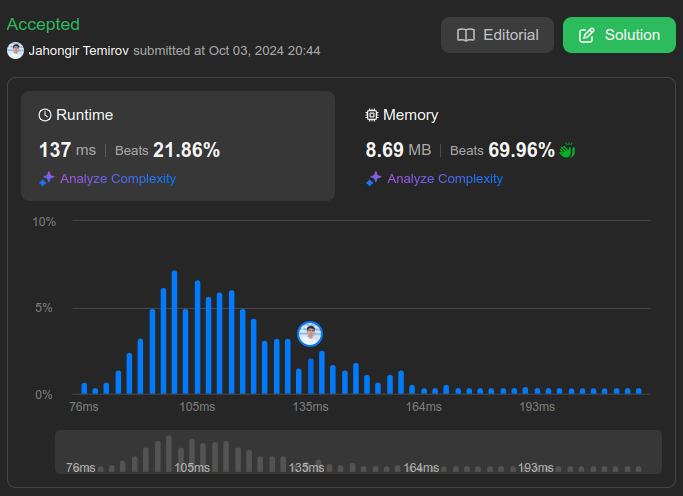

# 134. Gas Station
🟧 Medium

There are `n` gas stations along a circular route, where the amount of gas at the `i^th` station is `gas[i]`.

You have a car with an unlimited gas tank and it costs `cost[i]` of gas to travel from the `i^th` station to its next `(i + 1)^th` station. You begin the journey with an empty tank at one of the gas stations.

Given two integer arrays `gas` and `cost`, return *the starting gas station's index if you can travel around the circuit once in the clockwise direction, otherwise return `-1`*. If there exists a solution, it is **guaranteed** to be **unique**.

## Example 1:
> **Input**: gas = [1,2,3,4,5], cost = [3,4,5,1,2] \
> **Output**: 3 \
> **Explanation**: Start at station 3 (index 3) and fill up with 4 unit of gas. Your tank = 0 + 4 = 4 \
Travel to station 4. Your tank = 4 - 1 + 5 = 8 \
Travel to station 0. Your tank = 8 - 2 + 1 = 7 \
Travel to station 1. Your tank = 7 - 3 + 2 = 6 \
Travel to station 2. Your tank = 6 - 4 + 3 = 5 \
Travel to station 3. The cost is 5. Your gas is just enough to travel back to station 3. \
Therefore, return 3 as the starting index.

## Example 2:
> **Input**: gas = [2,3,4], cost = [3,4,3] \
> **Output**: -1 \
> **Explanation**: You can't start at station 0 or 1, as there is not enough gas to travel to the next station. \
Let's start at station 2 and fill up with 4 unit of gas. Your tank = 0 + 4 = 4 \
Travel to station 0. Your tank = 4 - 3 + 2 = 3 \
Travel to station 1. Your tank = 3 - 3 + 3 = 3 \
You cannot travel back to station 2, as it requires 4 unit of gas but you only have 3. \
Therefore, you can't travel around the circuit once no matter where you start. 

## Constraints:
* `n == gas.length == cost.length`
* `1 <= n <= 10^5`
* `0 <= gas[i], cost[i] <= 10^4`

## Solution
> **My Solution**
> ```go
> func canCompleteCircuit(gas []int, cost []int) int {
> 	start, fill, total := 0, 0, 0
> 	for i := 0; i < len(gas); i++ {
> 		total += gas[i] - cost[i]
> 		fill += gas[i] - cost[i]
> 		if fill < 0 {
> 			fill = 0
> 			start = i + 1
> 		}
> 	}
> 	if total < 0 {
> 		return -1
> 	}
> 	return start % len(gas)
> }
> ```



Leetcode: [link](https://leetcode.com/problems/gas-station/description)
