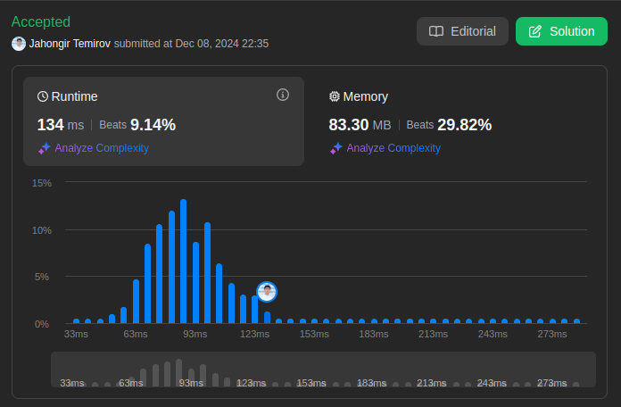

# 146. LRU Cache

Medium

Design a data structure that follows the constraints of a [Least Recently Used (LRU) cache](https://en.wikipedia.org/wiki/Cache_replacement_policies#LRU).

Implement the `LRUCache` class:

* `LRUCache(int capacity)` Initialize the LRU cache with positive size `capacity`.
* `int get(int key)` Return the value of the key if the `key` exists, otherwise return `-1`.
* `void put(int key, int value)` Update the value of the `key` if the `key` exists. Otherwise, add the `key-value` pair to the cache. If the number of keys exceeds the `capacity` from this operation, evict the least recently used key.

The functions `get` and `put` must each run in `O(1)` average time complexity.

## Example 1

> **Input**: ["LRUCache", "put", "put", "get", "put", "get", "put", "get", "get", "get"]
[[2], [1, 1], [2, 2], [1], [3, 3], [2], [4, 4], [1], [3], [4]] \
> **Output**: [null, null, null, 1, null, -1, null, -1, 3, 4] \
> **Explanation**: \
> LRUCache lRUCache = new LRUCache(2); \
> lRUCache.put(1, 1); // cache is {1=1} \
> lRUCache.put(2, 2); // cache is {1=1, 2=2} \
> lRUCache.get(1);    // return 1 \
> lRUCache.put(3, 3); // LRU key was 2, evicts key 2, cache is {1=1, 3=3} \
> lRUCache.get(2);    // returns -1 (not found) \
> lRUCache.put(4, 4); // LRU key was 1, evicts key 1, cache is {4=4, 3=3} \
> lRUCache.get(1);    // return -1 (not found) \
> lRUCache.get(3);    // return 3 \
> lRUCache.get(4);    // return 4

## Constraints

* `1 <= capacity <= 3000`
* `0 <= key <= 10^4`
* `0 <= value <= 10^5`
* At most `2 * 10^5` calls will be made to `get` and `put`.

## Solution

My Solution

```go
type LRUCache struct {
    Head, Tail *Node
    M map[int]*Node
    Capacity int
}

type Node struct {
    Prev, Next *Node
    Key, Value int
}

func Constructor(capacity int) LRUCache {
    head, tail := &Node{Key:0, Value:0}, &Node{Key:0, Value:0}
    head.Next = tail
    tail.Prev = head
    return LRUCache{
        Capacity:capacity,
        M: make(map[int]*Node),
        Head: head,
        Tail: tail,
    }
}


func (this *LRUCache) Get(key int) int {
    if n, ok := this.M[key]; ok {
        this.remove(n)
        this.insert(n)
        return n.Value
    }

    return -1
}


func (this *LRUCache) Put(key int, value int)  {
    if _, ok := this.M[key]; ok {
        this.remove(this.M[key])
    }

    if len(this.M) == this.Capacity {
        this.remove(this.Tail.Prev)
    }

    this.insert(&Node{Key:key, Value: value})
}

func (this *LRUCache) remove(node *Node) {
    delete(this.M, node.Key)
    node.Prev.Next = node.Next
    node.Next.Prev = node.Prev
}

func (this *LRUCache) insert(node *Node) {
    this.M[node.Key] = node
    next := this.Head.Next
    this.Head.Next = node
    node.Prev = this.Head
    next.Prev = node
    node.Next = next
}


/**
 * Your LRUCache object will be instantiated and called as such:
 * obj := Constructor(capacity);
 * param_1 := obj.Get(key);
 * obj.Put(key,value);
 */
```

## Optimal Solution

The optimal solution for an LRU Cache uses a combination of:

1. HashMap for O(1) key-value lookups
2. Doubly Linked List for O(1) insertion/deletion
3. Pointer manipulation for updating access order

```go
// The implementation above is already optimal in terms of time complexity
// Here's an alternative implementation with better readability and encapsulation

type LRUCache struct {
    capacity int
    cache    map[int]*Node
    head     *Node // sentinel head
    tail     *Node // sentinel tail
}

type Node struct {
    key, value int
    prev, next *Node
}

func Constructor(capacity int) LRUCache {
    lru := LRUCache{
        capacity: capacity,
        cache:    make(map[int]*Node),
        head:     &Node{},
        tail:     &Node{},
    }
    // Connect head and tail
    lru.head.next = lru.tail
    lru.tail.prev = lru.head
    return lru
}

func (lru *LRUCache) Get(key int) int {
    if node, exists := lru.cache[key]; exists {
        lru.moveToFront(node)
        return node.value
    }
    return -1
}

func (lru *LRUCache) Put(key int, value int) {
    if node, exists := lru.cache[key]; exists {
        node.value = value
        lru.moveToFront(node)
        return
    }
    
    newNode := &Node{key: key, value: value}
    lru.cache[key] = newNode
    lru.addToFront(newNode)
    
    if len(lru.cache) > lru.capacity {
        lru.removeLRU()
    }
}

func (lru *LRUCache) moveToFront(node *Node) {
    lru.removeFromList(node)
    lru.addToFront(node)
}

func (lru *LRUCache) addToFront(node *Node) {
    node.prev = lru.head
    node.next = lru.head.next
    lru.head.next.prev = node
    lru.head.next = node
}

func (lru *LRUCache) removeFromList(node *Node) {
    node.prev.next = node.next
    node.next.prev = node.prev
}

func (lru *LRUCache) removeLRU() {
    lruNode := lru.tail.prev
    lru.removeFromList(lruNode)
    delete(lru.cache, lruNode.key)
}
```

### Approach Analysis

The LRU Cache implementation uses two main data structures:

1. **HashMap (map[int]*Node)**:

   * Provides O(1) access to cache entries
   * Maps keys to doubly-linked list nodes
   * Enables quick lookups for get/put operations

2. **Doubly Linked List**:

   * Maintains access order of elements
   * Most recently used items at front
   * Least recently used items at back
   * Allows O(1) removal/insertion of nodes

### Visualization of Both Approaches

```text
Initial state (capacity = 2):
HEAD ⟷ TAIL
map[]

After put(1,1):
HEAD ⟷ [1,1] ⟷ TAIL
map[1 → Node(1,1)]

After put(2,2):
HEAD ⟷ [2,2] ⟷ [1,1] ⟷ TAIL
map[1 → Node(1,1), 2 → Node(2,2)]

After get(1): // moves 1 to front
HEAD ⟷ [1,1] ⟷ [2,2] ⟷ TAIL
map[1 → Node(1,1), 2 → Node(2,2)]

After put(3,3): // evicts 2 (LRU)
HEAD ⟷ [3,3] ⟷ [1,1] ⟷ TAIL
map[1 → Node(1,1), 3 → Node(3,3)]
```

### Complexity Analysis

**Time Complexity:**

* Constructor: O(1)
* Get: O(1)
* Put: O(1)
* All internal operations (moveToFront, removeLRU): O(1)

**Space Complexity:**

* O(capacity) for both HashMap and Linked List
* Each entry requires:
  * HashMap entry: O(1)
  * Linked List node: O(1)
  * Total per entry: O(1)

### Why Solution Works

1. **HashMap + Linked List Synergy:**
   * HashMap provides instant access to nodes
   * Linked List maintains order without requiring shifts
   * Both structures complement each other's weaknesses

2. **Sentinel Nodes (Head/Tail):**
   * Eliminate edge cases in node manipulation
   * Simplify insertion/deletion logic
   * No need to check for null pointers

3. **Encapsulated Operations:**
   * moveToFront handles the "recently used" aspect
   * removeLRU maintains capacity constraint
   * Clean separation of concerns

### When to Use

Use LRU Cache when:

1. Need O(1) access time for cache operations
2. Want to evict least recently used items when capacity is reached
3. Memory usage can be bounded by a fixed capacity
4. Recent access patterns are good predictors of future accesses

Common applications:

* Database query caching
* Web browser page caching
* File system caching
* Memory management in operating systems

### Common Patterns & Applications

1. **Caching Pattern:**
   * Fast access to recent items
   * Automatic eviction of stale items
   * Fixed memory footprint

2. **Doubly Linked List Pattern:**
   * O(1) removal from any position
   * O(1) insertion at any position
   * Bidirectional traversal capability

3. **HashMap + Linked List Pattern:**
   * Common in cache implementations
   * Combines fast lookup with ordered access
   * Used in many system designs

### Interview Tips

1. **Implementation Strategy:**
   * Start with data structure definitions
   * Implement basic operations first
   * Add edge case handling
   * Consider thread safety if asked

2. **Key Points to Mention:**
   * Why you chose the data structures
   * Time/space complexity analysis
   * How you handle edge cases
   * Possible optimizations

3. **Common Follow-up Questions:**
   * How to make it thread-safe?
   * How to implement LFU Cache instead?
   * How to handle variable entry sizes?
   * How to implement distributed LRU Cache?

4. **Gotchas to Watch For:**
   * Memory leaks in evicted entries
   * Proper linking/unlinking of nodes
   * HashMap and List consistency
   * Capacity edge cases



Leetcode: [link](https://leetcode.com/problems/lru-cache/description/)
