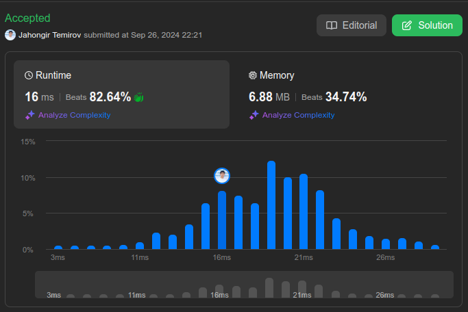

# 169. Majority Element
🟩 Easy

Given an array `nums` of size `n`, return the majority element.

The majority element is the element that appears more than `⌊n / 2⌋` times. You may assume that the majority element always exists in the array.

## Example 1:
> **Input**: nums = [3,2,3] \
> **Output**: 3 

## Example 2:
> **Input**: nums = [2,2,1,1,1,2,2] \
> **Output**: 2

## Constraints:
* `n == nums.length`
* `1 <= n <= 5 * 10^4`
* `-10^9 <= nums[i] <= 10^9`

**Follow-up**: Could you solve the problem in linear time and in `O(1)` space?

## Solution
> **My Solution**
> ```go
> func majorityElement(nums []int) int {
>     var majority, count int
> 
>     for _, num := range nums {
>         if count == 0 {
>             majority = num
>         }
>         if num == majority {
>             count++
>         } else {
>             count--
>         }
>     }
> 
>     return majority
> }
> ```



Leetcode: [link](https://leetcode.com/problems/majority-element/description)