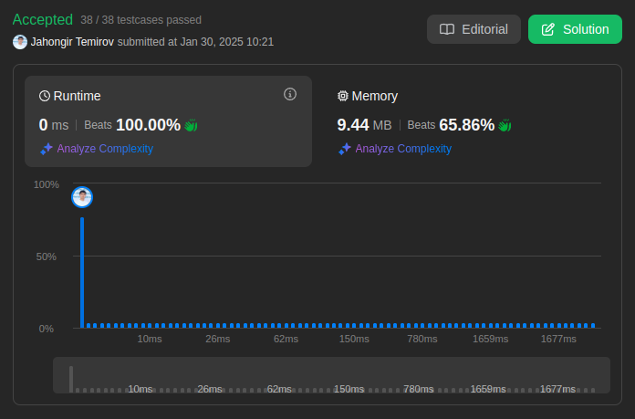

# 189. Rotate Array

🟧 Medium

Given an integer array `nums`, rotate the array to the right by `k` steps, where `k` is non-negative.

## Example 1

> **Input**: nums = [1,2,3,4,5,6,7], k = 3 \
> **Output**: [5,6,7,1,2,3,4] \
> **Explanation**: \
> rotate 1 steps to the right: [7,1,2,3,4,5,6] \
> rotate 2 steps to the right: [6,7,1,2,3,4,5] \
> rotate 3 steps to the right: [5,6,7,1,2,3,4]

## Example 2

> **Input**: nums = [-1,-100,3,99], k = 2 \
> **Output**: [3,99,-1,-100] \
> **Explanation**: \
> rotate 1 steps to the right: [99,-1,-100,3] \
> rotate 2 steps to the right: [3,99,-1,-100]

## Constraints

* `1 <= nums.length <= 10^5`
* `-2^31 <= nums[i] <= 2^31 - 1`
* `0 <= k <= 10^5`

## Hint-1

> The easiest solution would use additional memory and that is perfectly fine.

## Hint-2

> The actual trick comes when trying to solve this problem without using any additional memory. This means you need to use the original array somehow to move the elements around. Now, we can place each element in its original location and shift all the elements around it to adjust as that would be too costly and most likely will time out on larger input arrays.

## Hint-3

> One line of thought is based on reversing the array (or parts of it) to obtain the desired result. Think about how reversal might potentially help us out by using an example.

## Hint-4

> The other line of thought is a tad bit complicated but essentially it builds on the idea of placing each element in its original position while keeping track of the element originally in that position. Basically, at every step, we place an element in its rightful position and keep track of the element already there or the one being overwritten in an additional variable. We can't do this in one linear pass and the idea here is based on cyclic-dependencies between elements.

## Solution

My Solution

```go
func rotate(nums []int, k int) {
  n := len(nums)
  k %= n  
  reverse(nums, 0, n-1)
  reverse(nums, 0, k-1)
  reverse(nums, k, n-1)
}

func reverse(nums []int, start, end int) {
  for start < end {
    nums[start], nums[end] = nums[end], nums[start]
    start++
    end--
  }
}
```



Leetcode: [link](https://leetcode.com/problems/rotate-array/description/)
