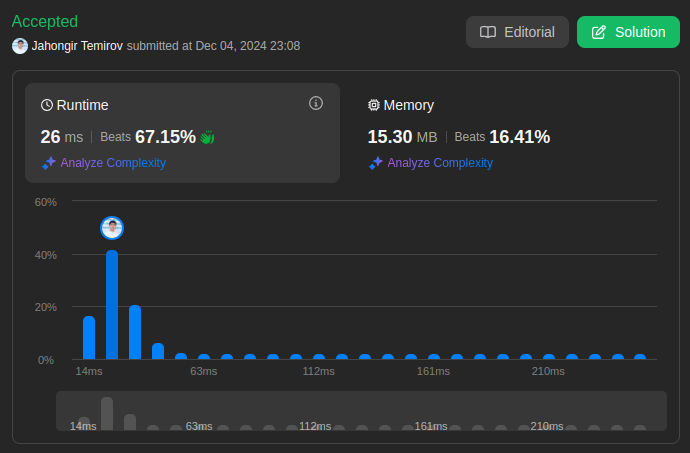

# 219. Contains Duplicate II

🟩 Easy

Given an integer array `nums` and an integer `k`, return `true` if there are two **distinct indices** `i` and `j` in the array such that `nums[i] == nums[j]` and `abs(i - j) <= k`.

## Example 1

> **Input**: nums = [1,2,3,1], k = 3 \
> **Output**: true

## Example 2

> **Input**: nums = [1,0,1,1], k = 1 \
> **Output**: true

## Example 3

> **Input**: nums = [1,2,3,1,2,3], k = 2 \
> **Output**: false

## Constraints

* `1 <= nums.length <= 10^5`
* `-10^9 <= nums[i] <= 10^9`
* `0 <= k <= 10^5`

## Solution

My Solution (Hash Map with Index)

```go
func containsNearbyDuplicate(nums []int, k int) bool {
    m := make(map[int]int)

    for i, num := range nums {
        if j, ok := m[num]; ok && abs(i-j) <= k{
            return true
        }
        m[num]=i
    }

    return false
}

func abs(x int) int {
    if x < 0 {
        x *= -1
    }
    return x
}
```

Optimal Solution 1 (Sliding Window)

```go
func containsNearbyDuplicate(nums []int, k int) bool {
    window := make(map[int]bool)
    
    for i := 0; i < len(nums); i++ {
        // Remove element outside window
        if i > k {
            delete(window, nums[i-k-1])
        }
        
        // Check if current number exists in window
        if window[nums[i]] {
            return true
        }
        
        // Add current number to window
        window[nums[i]] = true
    }
    
    return false
}
```

Optimal Solution 2 (Two Pointers)

```go
func containsNearbyDuplicate(nums []int, k int) bool {
    n := len(nums)
    
    for i := 0; i < n; i++ {
        // Only check up to k positions ahead
        for j := i + 1; j <= i + k && j < n; j++ {
            if nums[i] == nums[j] {
                return true
            }
        }
    }
    
    return false
}
```

### Approach Analysis

This problem demonstrates different approaches to handle window constraints:

1. Hash Map with Index (Your Solution):
   * Store value-index pairs
   * Check distance on duplicates
   * Early termination
   * Space-time balanced

2. Sliding Window:
   * Maintain k-sized window
   * Remove old elements
   * Check current window
   * Memory efficient

3. Two Pointers:
   * Direct index comparison
   * Limited search range
   * No extra space
   * Simple implementation

### Visualization of Approaches

#### Hash Map Process (Your Solution)

```text
Input: nums = [1,2,3,1], k = 3

Step 1: map = {1: 0}
Step 2: map = {1: 0, 2: 1}
Step 3: map = {1: 0, 2: 1, 3: 2}
Step 4: Check 1 → found at index 0
        abs(3-0) = 3 ≤ k(3)
        return true
```

#### Sliding Window Process

```text
Input: nums = [1,2,3,1], k = 3

Step 1: window = {1}
Step 2: window = {1,2}
Step 3: window = {1,2,3}
Step 4: Check 1 → found in window
        return true
```

#### Two Pointers Process

```text
Input: nums = [1,2,3,1], k = 3

i=0: check [1,2,3] → no match
i=1: check [2,3,1] → no match
i=2: check [3,1] → no match
i=3: done (previous checks covered all pairs)
```

### Complexity Analysis

#### Hash Map Solution (Your Solution)

* Time: O(n)
  * Single pass through array
  * O(1) map operations
  * Early termination

* Space: O(n)
  * Stores all unique indices
  * Map overhead
  * Worst case: all unique

#### Sliding Window Solution

* Time: O(n)
  * Linear scan
  * Window operations O(1)
  * Delete operations O(1)

* Space: O(k)
  * Fixed window size
  * Maximum k elements
  * More memory efficient

#### Two Pointers Solution

* Time: O(n*k)
  * Nested loops
  * k comparisons per element
  * No early termination

* Space: O(1)
  * No extra storage
  * Only pointers
  * Most space efficient

### Why Solutions Work

1. Hash Map Logic:
   * Track last seen index
   * Quick distance check
   * Update on duplicates
   * Maintain history

2. Sliding Window:
   * Fixed size window
   * Remove old elements
   * Contains duplicates
   * Distance guaranteed

3. Two Pointers:
   * Direct comparison
   * Limited range check
   * No extra storage
   * Simple but slower

### When to Use

1. Hash Map When:
   * Memory available
   * Quick lookups needed
   * Early termination helps
   * Index tracking important

2. Sliding Window When:
   * Memory constrained
   * Fixed window size
   * Stream processing
   * Order matters

3. Two Pointers When:
   * No extra space allowed
   * k is small
   * Simple code preferred
   * Memory critical

### Common Patterns & Applications

1. Related Problems:
   * Contains Duplicate III
   * Sliding Window Maximum
   * Find All Anagrams
   * Longest Substring

2. Key Techniques:
   * Sliding window
   * Hash map tracking
   * Two pointers
   * Distance constraints

### Interview Tips

1. Solution Highlights:
   * Multiple approaches
   * Space-time tradeoffs
   * Early termination
   * Window management

2. Common Pitfalls:
   * Off-by-one errors
   * Window boundaries
   * Index calculations
   * Memory management

3. Testing Strategy:
   * k = 0 case
   * k > array length
   * Duplicate at distance k
   * No duplicates
   * All duplicates

4. Follow-up Questions:
   * Streaming data?
   * Limited memory?
   * Parallel processing?
   * Different distance metrics?



Leetcode: [link](https://leetcode.com/problems/contains-duplicate-ii/description/)
