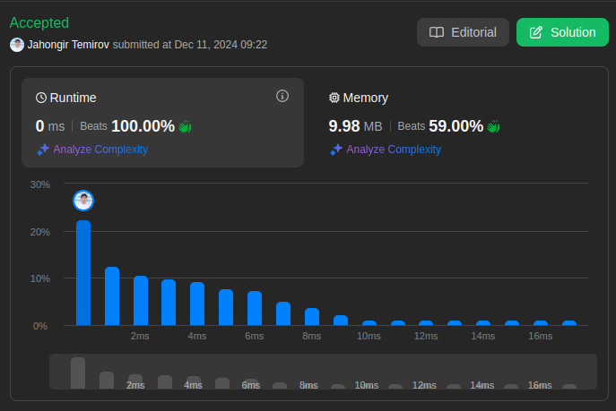

# 238. Product of Array Except Self

🟧 Medium

Given an integer array `nums`, return *an array `answer` such that `answer[i]` is equal to the product of all the elements of `nums` except `nums[i]`.*

The product of any prefix or suffix of `nums` is **guaranteed** to fit in a **32-bit** integer.

You must write an algorithm that runs in `O(n)` time and without using the division operation.

## Example 1

> **Input**: nums = [1,2,3,4] \
> **Output**: [24,12,8,6]

## Example 2

> **Input**: nums = [-1,1,0,-3,3] \
> **Output**: [0,0,9,0,0]

## Constraints

* `2 <= nums.length <= 10^5`
* `-30 <= nums[i] <= 30`
* The product of any prefix or suffix of `nums` is **guaranteed** to fit in a **32-bit** integer.

**Follow up**: Can you solve the problem in `O(1)` extra space complexity? (The output array **does not** count as extra space for space complexity analysis.)

## Solution

My Solution

```go
func productExceptSelf(nums []int) []int {
  res := make([]int, len(nums))

    left := 1
    for i ,num := range nums {
        res[i]=left
        left *= num
    }
    
    right := 1
    for i:=len(nums)-1; i>=0; i-- {
        res[i]*=right
        right*=nums[i]
    }

  return res
}
```

## Optimal Solution

The optimal solution uses prefix and suffix products without using division:

```go
func productExceptSelf(nums []int) []int {
    n := len(nums)
    result := make([]int, n)
    
    // Initialize result array with 1s
    result[0] = 1
    
    // Calculate prefix products
    for i := 1; i < n; i++ {
        result[i] = result[i-1] * nums[i-1]
    }
    
    // Calculate suffix products and combine with prefix
    suffix := 1
    for i := n-1; i >= 0; i-- {
        result[i] *= suffix
        suffix *= nums[i]
    }
    
    return result
}
```

### Approach Analysis

The solution uses two key techniques:

1. **Prefix Products**:
   * Calculate products of all elements to the left
   * Store intermediate results in output array
   * Build up products from left to right

2. **Suffix Products**:
   * Calculate products of all elements to the right
   * Combine with prefix products
   * Use single variable to save space

### Visualization of Both Approaches

```text
Input: [1,2,3,4]

Step 1: Calculate Prefix Products
Initial: [1, _, _, _]
After 1: [1, 1, _, _]
After 2: [1, 1, 2, _]
After 3: [1, 1, 2, 6]

Step 2: Calculate Suffix Products
suffix = 1
[1, 1, 2, 6] * [24, 12, 4, 1]
= [24, 12, 8, 6]

Detailed Steps:
i=3: result[3] = 6 * 1 = 6,    suffix = 4
i=2: result[2] = 2 * 4 = 8,    suffix = 12
i=1: result[1] = 1 * 12 = 12,  suffix = 24
i=0: result[0] = 1 * 24 = 24,  suffix = 24

Final Result: [24, 12, 8, 6]
```

### Complexity Analysis

**Time Complexity**:

* O(n) - two passes through the array
* First pass: prefix products
* Second pass: suffix products
* No nested loops

**Space Complexity**:

* O(1) - excluding output array
* Only one extra variable (suffix)
* Output array not counted as extra space

**Optimizations**:

* No division operation used
* Reuse output array for prefix products
* Single variable for suffix products
* No extra arrays needed

### Why Solution Works

1. **Prefix-Suffix Combination**:
   * Each position gets products from both sides
   * Left products stored in result array
   * Right products multiplied during second pass
   * Avoids division operation

2. **Space Optimization**:
   * Reuses output array for intermediate results
   * Needs only one extra variable
   * Maintains O(1) extra space
   * Efficient memory usage

3. **Two-Pass Approach**:
   * First pass builds left products
   * Second pass combines with right products
   * Each element gets complete product
   * Handles zeros naturally

### When to Use

This approach is ideal when:

1. Division operation is not allowed
2. O(1) extra space required
3. Need products of all elements except self
4. Array elements can be positive/negative/zero

Common applications:

* Array transformation problems
* Product calculations without division
* Space-constrained environments
* Interview problems

### Common Patterns & Applications

1. **Prefix-Suffix Pattern**:
   * Build products from both directions
   * Combine intermediate results
   * Use output array for storage
   * O(1) extra space

2. **Two-Pass Array**:
   * Forward pass for prefix
   * Backward pass for suffix
   * Combine results in-place
   * Space-efficient solution

3. **Array Manipulation**:
   * In-place modifications
   * Running products
   * Direction-based processing
   * Space optimization

### Interview Tips

1. **Initial Clarification**:
   * Confirm if division is allowed
   * Ask about space constraints
   * Clarify handling of zeros
   * Discuss integer overflow

2. **Solution Walkthrough**:
   * Start with brute force approach
   * Explain space optimization
   * Show how to avoid division
   * Demonstrate two-pass technique

3. **Code Implementation Strategy**:
   * Initialize result array
   * Implement prefix products
   * Add suffix products
   * Handle edge cases

4. **Optimization Discussion**:
   * Why division is problematic
   * How to save space
   * Handling large numbers
   * Performance considerations

5. **Common Pitfalls to Avoid**:
   * Using division
   * Creating extra arrays
   * Missing edge cases
   * Integer overflow

6. **Follow-up Questions**:
   * Q: "How to handle integer overflow?"
     A: Use long/big integers or modulo arithmetic

   * Q: "Can we optimize for arrays with zeros?"
     A: Count zeros and handle special cases

   * Q: "How to parallelize this solution?"
     A: Split array and combine partial products

   * Q: "What if array is very large?"
     A: Consider chunking and parallel processing

7. **Edge Cases to Test**:
   * Array with zeros
   * Array with negative numbers
   * Array with ones
   * Minimum length array (2)
   * Maximum length array

8. **Code Quality Points**:
   * Clear variable names
   * Efficient array initialization
   * Clean loop logic
   * Proper comments

9. **Alternative Approaches**:
   * Using logarithms (not recommended)
   * Division-based (if allowed)
   * Recursive solution
   * Parallel processing

10. **Performance Analysis**:
    * Best case: O(n)
    * Worst case: O(n)
    * Memory: O(1)
    * CPU cache friendly



Leetcode: [link](https://leetcode.com/problems/product-of-array-except-self/description/)
