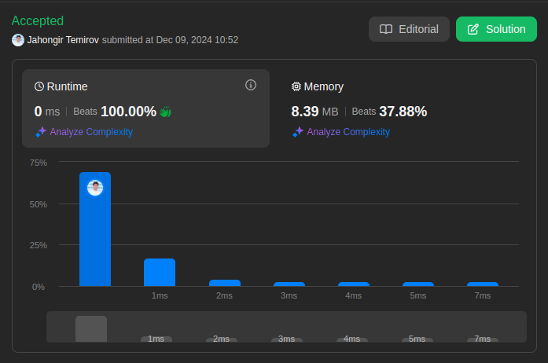

# 637. Average of Levels in Binary Tree

 Easy

Given the `root` of a binary tree, return *the average value of the nodes on each level in the form of an array*. Answers within `10^-5` of the actual answer will be accepted.

## Example 1


> **Input**: root = [3,9,20,null,null,15,7] \
> **Output**: [3.00000,14.50000,11.00000] \
> **Explanation**: The average value of nodes on level 0 is 3, on level 1 is 14.5, and on level 2 is 11.
Hence return [3, 14.5, 11].

## Example 2


> **Input**: root = [3,9,20,15,7] \
> **Output**: [3.00000,14.50000,11.00000]

## Constraints

* The number of nodes in the tree is in the range `[1, 10^4]`.
* `-2^31 <= Node.val <= 2^31 - 1`

## Solution

My Solution

```go
/**
 * Definition for a binary tree node.
 * type TreeNode struct {
 *     Val int
 *     Left *TreeNode
 *     Right *TreeNode
 * }
 */
func averageOfLevels(root *TreeNode) []float64 {
    resp := []float64{}

    queue := []*TreeNode{root}

    for len(queue) != 0 {
        size := len(queue)
        level := 0

        for i:=0; i < size; i++ {
            level += queue[i].Val

            if queue[i].Left != nil {
                queue = append(queue, queue[i].Left)
            }

            if queue[i].Right != nil {
                queue = append(queue, queue[i].Right)
            }
        }

        queue = queue[size:]
        resp = append(resp, float64(level)/float64(size))
    }

    return resp
}
```

## Optimal Solution

The optimal solution uses level-order traversal (BFS) with two key improvements:

1. Using `int64` to handle potential integer overflow
2. Pre-allocating the result slice for better performance
3. Efficient queue management with slice operations

```go
func averageOfLevels(root *TreeNode) []float64 {
    if root == nil {
        return nil
    }
    
    // Pre-allocate result slice (optimization)
    result := make([]float64, 0, 10000) // max nodes = 10^4
    
    // Initialize queue with root
    queue := []*TreeNode{root}
    
    for len(queue) > 0 {
        levelSize := len(queue)
        levelSum := int64(0) // Use int64 to prevent overflow
        
        // Process current level
        for i := 0; i < levelSize; i++ {
            node := queue[0]
            queue = queue[1:] // More efficient queue management
            
            levelSum += int64(node.Val)
            
            // Add children to queue
            if node.Left != nil {
                queue = append(queue, node.Left)
            }
            if node.Right != nil {
                queue = append(queue, node.Right)
            }
        }
        
        // Calculate and store average
        avg := float64(levelSum) / float64(levelSize)
        result = append(result, avg)
    }
    
    return result
}
```

### Approach Analysis

The solution employs two main techniques:

1. **Level-Order Traversal (BFS)**:
   * Uses queue data structure
   * Processes nodes level by level
   * Maintains level boundaries
   * Ensures correct level averages

2. **Efficient Memory Management**:
   * Pre-allocated result slice
   * Optimized queue operations
   * Integer overflow prevention
   * Proper type conversions

### Visualization of Both Approaches

```text
Example Tree:
     3
   /   \
  9    20
      /  \
     15   7

BFS Traversal Steps:

Level 0: [3]
Queue: [3]
Sum: 3
Average: 3.0

Level 1: [9, 20]
Queue: [9, 20]
Sum: 29
Average: 14.5

Level 2: [15, 7]
Queue: [15, 7]
Sum: 22
Average: 11.0

Final Result: [3.0, 14.5, 11.0]
```

### Complexity Analysis

**Time Complexity**:

* O(n) - visit each node exactly once
* O(1) - queue operations (append/remove)
* O(1) - average calculation per level
* Total: O(n) where n is number of nodes

**Space Complexity**:

* O(w) - queue size (w = max width of tree)
* O(h) - result array (h = height of tree)
* Total: O(w) where w is maximum width

**Optimizations**:

* Pre-allocated result slice
* int64 for overflow prevention
* Efficient queue management
* Early nil check

### Why Solution Works

1. **BFS Properties**:
   * Natural level-by-level traversal
   * Maintains level boundaries
   * Complete level processing
   * Correct order guarantee

2. **Memory Management**:
   * Efficient slice operations
   * No extra data structures
   * Minimal memory overhead
   * Prevents integer overflow

3. **Average Calculation**:
   * Accurate level tracking
   * Proper type handling
   * Precision maintenance
   * Overflow prevention

### When to Use

This approach is ideal when:

1. Need level-by-level tree processing
2. Require level-based calculations
3. Memory can handle tree width
4. Order within levels doesn't matter

Common applications:

* Level-order tree traversal
* Level statistics calculation
* Tree visualization
* Level-based tree operations

### Common Patterns & Applications

1. **BFS Pattern**:
   * Queue-based traversal
   * Level-by-level processing
   * Width-first exploration
   * Level boundary tracking

2. **Tree Level Processing**:
   * Level statistics
   * Level modifications
   * Level grouping
   * Level comparisons

3. **Average Calculations**:
   * Numeric overflow handling
   * Floating-point precision
   * Group-based statistics
   * Level-based metrics

### Interview Tips

1. **Initial Clarification**:
   * Confirm if we need to handle empty tree
   * Ask about precision requirements for averages
   * Clarify if the order of nodes within levels matters
   * Discuss memory constraints for large trees

2. **Solution Walkthrough**:
   * Start with BFS approach explanation
   * Mention queue usage for level tracking
   * Explain why BFS is better than DFS here
   * Discuss integer overflow prevention

3. **Code Implementation Strategy**:
   * Begin with basic queue structure
   * Add level size tracking
   * Implement sum calculation with overflow prevention
   * Handle edge cases last

4. **Optimization Discussion**:
   * Pre-allocate slices for better performance
   * Use int64 for sum to prevent overflow
   * Efficient queue management with slice operations
   * Early termination for nil root

5. **Common Pitfalls to Avoid**:
   * Integer overflow with large numbers
   * Not tracking level boundaries correctly
   * Inefficient queue operations
   * Missing edge cases

6. **Follow-up Questions**:
   * Q: "How would you handle a very wide tree?"
     A: Use level-by-level processing to limit memory usage

   * Q: "Can we solve this using DFS?"
     A: Yes, using a map to track level sums and counts
  
   * Q: "How to optimize memory usage?"
     A: Process nodes level by level, reuse queue space
  
   * Q: "What if we need exact decimal precision?"
     A: Use big.Float or similar for precise calculations

7. **Edge Cases to Test**:
   * Empty tree: return empty slice
   * Single node: return [node.Val]
   * Complete binary tree: maximum width
   * Skewed tree: minimal width
   * Large values: potential overflow

8. **Code Quality Points**:
   * Clear variable names (levelSize, levelSum)
   * Proper type conversions
   * Early return for nil
   * Clean queue management
   * Consistent error handling

9. **Alternative Approaches**:
   * DFS with level tracking
   * Iterative vs recursive
   * Array-based complete tree
   * Morris traversal variation

10. **Performance Analysis**:
    * Time: O(n) - visit each node once
    * Space: O(w) - w is max tree width
    * Memory-time tradeoffs
    * Optimization possibilities



Leetcode: [link](https://leetcode.com/problems/average-of-levels-in-binary-tree/description/)
