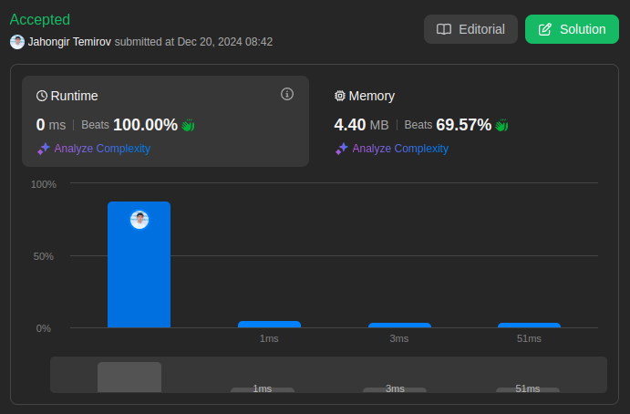

# 682. Baseball Game

🟩 Easy

You are keeping the scores for a baseball game with strange rules. At the beginning of the game, you start with an empty record.

You are given a list of strings `operations`, where `operations[i]` is the `i^th` operation you must apply to the record and is one of the following:

* An integer `x`.
  * Record a new score of `x`.
* `'+'`.
  * Record a new score that is the sum of the previous two scores.
* `'D'`.
  * Record a new score that is the double of the previous score.
* `'C'`.
  * Invalidate the previous score, removing it from the record.

Return *the sum of all the scores on the record after applying all the operations.*

The test cases are generated such that the answer and all intermediate calculations fit in a **32-bit** integer and that all operations are valid.

## Example 1

> **Input**: ops = ["5","2","C","D","+"] \
> **Output**: 30 \
> **Explanation**: "5" - Add 5 to the record, record is now [5]. \
> "2" - Add 2 to the record, record is now [5, 2]. \
> "C" - Invalidate and remove the previous score, record is now [5]. \
> "D" - Add 2 * 5 = 10 to the record, record is now [5, 10]. \
> "+" - Add 5 + 10 = 15 to the record, record is now [5, 10, 15]. \
> The total sum is 5 + 10 + 15 = 30.

## Example 2

> **Input**: ops = ["5","-2","4","C","D","9","+","+"] \
> **Output**: 27 \
> **Explanation**: "5" - Add 5 to the record, record is now [5].
> "-2" - Add -2 to the record, record is now [5, -2]. \
> "4" - Add 4 to the record, record is now [5, -2, 4]. \
> "C" - Invalidate and remove the previous score, record is now [5, -2]. \
> "D" - Add 2 * -2 = -4 to the record, record is now [5, -2, -4]. \
> "9" - Add 9 to the record, record is now [5, -2, -4, 9]. \
> "+" - Add -4 + 9 = 5 to the record, record is now [5, -2, -4, 9, 5]. \
> "+" - Add 9 + 5 = 14 to the record, record is now [5, -2, -4, 9, 5, 14]. \
> The total sum is 5 + -2 + -4 + 9 + 5 + 14 = 27.

## Example 3

> **Input**: ops = ["1","C"] \
> **Output**: 0 \
> **Explanation**: "1" - Add 1 to the record, record is now [1]. \
> "C" - Invalidate and remove the previous score, record is now []. \
> Since the record is empty, the total sum is 0.

## Constraints

* `1 <= operations.length <= 1000`
* `operations[i]` is `"C"`, `"D"`, `"+"`, or a string representing an integer in the range `[-3 * 10^4, 3 * 10^4]`.
* For operation `"+"`, there will always be at least two previous scores on the record.
* For operations `"C"` and `"D"`, there will always be at least one previous score on the record.

## Solution

My Solution

```go
func calPoints(operations []string) int {
    sum := 0
    records := make([]int, 0, len(operations))

    for _, operation := range operations {
        if operation == "C" {
            records = records[: len(records)-1]
        } else if operation == "D" {
            records = append(records, records[len(records)-1]*2)
        } else if operation == "+" {
            records = append(records, records[len(records)-1] + records[len(records)-2])
        } else {
            num, _ := strconv.Atoi(operation)
            records = append(records, num)
        }
    }

    for _, num := range records {
        sum += num
    }

    return sum
}
```

Optimal Solution

```go
func calPoints(operations []string) int {
    stack := []int{}

    for _, op := range operations {
        switch op {
        case "+":
            // Add the sum of the last two scores
            n := len(stack)
            stack = append(stack, stack[n-1]+stack[n-2])
        case "D":
            // Double the last score
            stack = append(stack, 2*stack[len(stack)-1])
        case "C":
            // Remove the last score
            stack = stack[:len(stack)-1]
        default:
            // Convert the string to an integer and add it to the stack
            num, _ := strconv.Atoi(op)
            stack = append(stack, num)
        }
    }

    // Calculate the total score
    total := 0
    for _, score := range stack {
        total += score
    }

    return total
}
```



Leetcode: [link](https://leetcode.com/problems/baseball-game/description)
