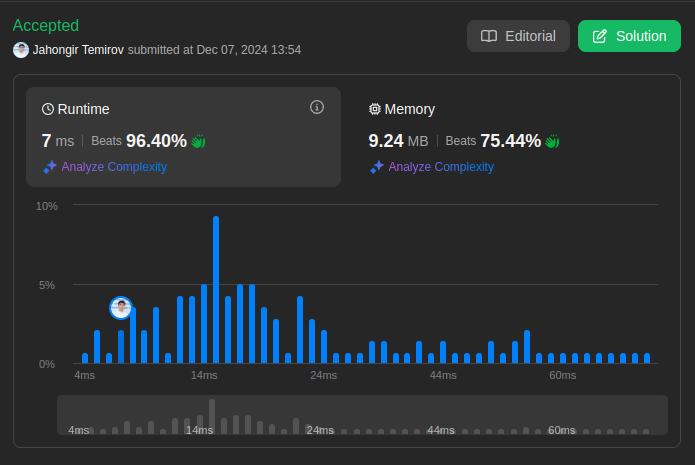

# 705. Design HashSet

🟩 Easy

Design a HashSet without using any built-in hash table libraries.

Implement `MyHashSet` class:

* `void add(key)` Inserts the value `key` into the HashSet.
* `bool contains(key)` Returns whether the value `key` exists in the HashSet or not.
* `void remove(key)` Removes the value `key` in the HashSet. If `key` does not exist in the HashSet, do nothing.

## Example 1

> **Input**: ["MyHashSet", "add", "add", "contains", "contains", "add", "contains", "remove", "contains"]
[[], [1], [2], [1], [3], [2], [2], [2], [2]] \
> **Output**: [null, null, null, true, false, null, true, null, false] \
> **Explanation**: \
> MyHashSet myHashSet = new MyHashSet(); \
> myHashSet.add(1);      // set = [1] \
> myHashSet.add(2);      // set = [1, 2] \
> myHashSet.contains(1); // return True \
> myHashSet.contains(3); // return False, (not found) \
> myHashSet.add(2);      // set = [1, 2] \
> myHashSet.contains(2); // return True \
> myHashSet.remove(2);   // set = [1] \
> myHashSet.contains(2); // return False, (already removed)

## Constraints

* `0 <= key <= 10^6`
* At most `10^4` calls will be made to `add`, `remove`, and `contains`.

## Solution

My Solution (Chaining with Linked Lists)

```go
type Node struct {
    Value int
    Next  *Node
}

type MyHashSet struct {
    buckets []*Node
    count   int
}

func Constructor() MyHashSet {
    buckets := make([]*Node, 4)
    return MyHashSet{
        buckets: buckets,
        count:   0,
    }
}

func (h *MyHashSet) index(key int) int {
    return key % len(h.buckets)
}

func (h *MyHashSet) Add(key int) {
    idx := h.index(key)

    curr := h.buckets[idx]

    if curr == nil {
        h.buckets[idx] = &Node{Value: key}
        h.count++
        return
    }

    for curr.Next != nil {
        if curr.Value == key {
            return
        }

        curr = curr.Next
    }

    if curr.Value != key {
        curr.Next = &Node{Value: key}
        h.count++
    }

    if float64(h.count)/float64(len(h.buckets)) > 0.75 {
        h.resize()
    }
}

func (h *MyHashSet) resize() {
    oldBuckets := h.buckets
    h.buckets = make([]*Node, len(h.buckets)*2)
    h.count = 0

    for _, key := range oldBuckets {
        for key != nil {
            h.Add(key.Value)
            key = key.Next
        }
    }
}

func (h *MyHashSet) Remove(key int) {
    idx := key % len(h.buckets)

    curr := h.buckets[idx]

    if curr != nil && curr.Value == key {
        h.buckets[idx] = h.buckets[idx].Next
        h.count--
        return
    }

    for curr != nil && curr.Next != nil {
        if curr.Next.Value == key {
            curr.Next = curr.Next.Next
            h.count--
            return
        }

        curr = curr.Next
    }
}

func (h *MyHashSet) Contains(key int) bool {
    idx := key % len(h.buckets)

    curr := h.buckets[idx]

    for curr != nil {
        if curr.Value == key {
            return true
        }

        curr = curr.Next
    }

    return false
}
```

Optimal Solution 1 (Open Addressing with Linear Probing)

```go
type MyHashSet struct {
    size    int
    buckets []int
}

func Constructor() MyHashSet {
    return MyHashSet{
        size:    0,
        buckets: make([]int, 16),
    }
}

func (h *MyHashSet) hash(key int) int {
    return key % len(h.buckets)
}

func (h *MyHashSet) Add(key int) {
    if h.Contains(key) {
        return
    }
    
    if float64(h.size)/float64(len(h.buckets)) > 0.75 {
        h.resize()
    }
    
    pos := h.hash(key)
    for h.buckets[pos] != 0 && h.buckets[pos] != -1 {
        pos = (pos + 1) % len(h.buckets)
    }
    
    h.buckets[pos] = key + 1 // Shift by 1 to handle key=0
    h.size++
}

func (h *MyHashSet) resize() {
    old := h.buckets
    h.buckets = make([]int, len(old)*2)
    h.size = 0
    
    for _, val := range old {
        if val > 0 {
            h.Add(val - 1) // Shift back to get original key
        }
    }
}

func (h *MyHashSet) Remove(key int) {
    pos := h.hash(key)
    for h.buckets[pos] != 0 {
        if h.buckets[pos] == key+1 {
            h.buckets[pos] = -1 // Mark as deleted
            h.size--
            return
        }
        pos = (pos + 1) % len(h.buckets)
    }
}

func (h *MyHashSet) Contains(key int) bool {
    pos := h.hash(key)
    for h.buckets[pos] != 0 {
        if h.buckets[pos] == key+1 {
            return true
        }
        pos = (pos + 1) % len(h.buckets)
    }
    return false
}
```

Optimal Solution 2 (Bit Vector for Small Keys)

```go
type MyHashSet struct {
    bits []uint64
}

func Constructor() MyHashSet {
    return MyHashSet{
        bits: make([]uint64, 15625), // (10^6 + 63) / 64
    }
}

func (h *MyHashSet) Add(key int) {
    wordIndex := key / 64
    bitIndex := uint(key % 64)
    h.bits[wordIndex] |= 1 << bitIndex
}

func (h *MyHashSet) Remove(key int) {
    wordIndex := key / 64
    bitIndex := uint(key % 64)
    h.bits[wordIndex] &^= 1 << bitIndex
}

func (h *MyHashSet) Contains(key int) bool {
    wordIndex := key / 64
    bitIndex := uint(key % 64)
    return h.bits[wordIndex]&(1<<bitIndex) != 0
}
```

### Approach Analysis

This problem showcases different hash set implementation strategies:

1. Chaining with Linked Lists (Your Solution):
   * Separate chaining for collisions
   * Dynamic resizing
   * Linked list traversal
   * Good for high load factors

2. Open Addressing:
   * Linear probing
   * In-place collision resolution
   * Efficient cache usage
   * Better for low load factors

3. Bit Vector:
   * Direct mapping
   * Bit-level operations
   * No collisions
   * Perfect for integers

### Visualization of Approaches

#### Chaining Process (Your Solution)

```text
Initial state: buckets = [nil, nil, nil, nil]

Add(1): [1->nil, nil, nil, nil]
Add(5): [1->5->nil, nil, nil, nil]
Add(2): [1->5->nil, 2->nil, nil, nil]

Remove(5): [1->nil, 2->nil, nil, nil]
```

#### Open Addressing Process

```text
Initial: [0,0,0,0,0,0,0,0]

Add(1):  [2,0,0,0,0,0,0,0]  // Store 2 (1+1)
Add(9):  [2,10,0,0,0,0,0,0] // Store 10 (9+1)
Add(17): [2,10,18,0,0,0,0,0] // Collision at 1, probe next

Remove(9): [2,-1,18,0,0,0,0,0] // Mark as deleted (-1)
```

#### Bit Vector Process

```text
Initial: [0000000000000000]

Add(1):    [0000000000000010]
Add(4):    [0000000000010010]
Remove(1): [0000000000010000]

Contains(4): Check bit at position 4
```

### Complexity Analysis

#### Chaining Solution (Your Solution)

* Time:
  * Add: O(1) average, O(n) worst
  * Remove: O(1) average, O(n) worst
  * Contains: O(1) average, O(n) worst

* Space: O(n)
  * Linked list nodes
  * Dynamic resizing
  * Load factor control

#### Open Addressing Solution

* Time:
  * Add: O(1) average, O(n) worst
  * Remove: O(1) average, O(n) worst
  * Contains: O(1) average, O(n) worst

* Space: O(n)
  * Contiguous array
  * Better cache locality
  * Load factor < 0.75

#### Bit Vector Solution

* Time:
  * Add: O(1)
  * Remove: O(1)
  * Contains: O(1)

* Space: O(M)
  * M = max key value
  * Very space efficient
  * Fixed size array

### Why Solutions Work

1. Chaining Logic:
   * Distributes collisions
   * Maintains insertion order
   * Easy to implement
   * Flexible growth

2. Open Addressing:
   * Cache-friendly
   * No extra pointers
   * Simple probing
   * Good locality

3. Bit Vector:
   * Direct mapping
   * Bit-level operations
   * No collisions
   * Perfect for integers

### When to Use

1. Chaining When:
   * High load factor
   * Memory not critical
   * Order matters
   * Many collisions

2. Open Addressing When:
   * Cache performance critical
   * Memory contiguous
   * Low load factor
   * Few collisions

3. Bit Vector When:
   * Small key range
   * Memory critical
   * Integer keys only
   * Fast operations needed

### Common Patterns & Applications

1. Related Problems:
   * Design HashMap
   * LRU Cache
   * Insert Delete GetRandom O(1)
   * Find Duplicate

2. Key Techniques:
   * Hash functions
   * Collision handling
   * Dynamic resizing
   * Memory management

### Interview Tips

1. Solution Highlights:
   * Collision handling
   * Load factor management
   * Space efficiency
   * Time complexity

2. Common Pitfalls:
   * Poor hash function
   * Missing edge cases
   * Memory leaks
   * Infinite loops

3. Testing Strategy:
   * Empty set
   * Duplicate keys
   * Collisions
   * Deletions
   * Resizing

4. Follow-up Questions:
   * Thread safety?
   * Custom objects?
   * Persistence?
   * Distribution?



Leetcode: [link](https://leetcode.com/problems/design-hashset/description/)
