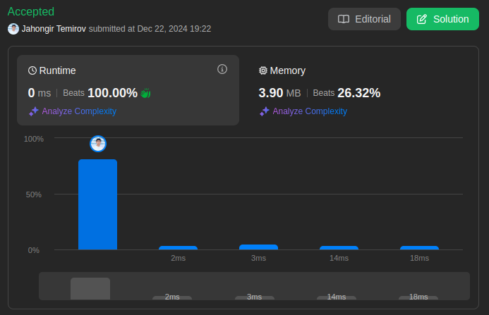

# 1041. Robot Bounded In Circle

🟧 Medium

On an infinite plane, a robot initially stands at `(0, 0)` and faces north. Note that:

* The **north direction** is the positive direction of the y-axis.
* The **south direction** is the negative direction of the y-axis.
* The **east direction** is the positive direction of the x-axis.
* The **west direction** is the negative direction of the x-axis.

The robot can receive one of three instructions:

* `"G"`: go straight 1 unit.
* `"L"`: turn 90 degrees to the left (i.e., anti-clockwise direction).
* `"R"`: turn 90 degrees to the right (i.e., clockwise direction).

The robot performs the `instructions` given in order, and repeats them forever.

Return `true` if and only if there exists a circle in the plane such that the robot never leaves the circle.

## Example 1

> **Input**: instructions = "GGLLGG" \
> **Output**: true \
> **Explanation**: The robot is initially at (0, 0) facing the north direction. \
> "G": move one step. Position: (0, 1). Direction: North. \
> "G": move one step. Position: (0, 2). Direction: North. \
> "L": turn 90 degrees anti-clockwise. Position: (0, 2). Direction: West. \
> "L": turn 90 degrees anti-clockwise. Position: (0, 2). Direction: South. \
> "G": move one step. Position: (0, 1). Direction: South. \
> "G": move one step. Position: (0, 0). Direction: South. \
> Repeating the instructions, the robot goes into the cycle: (0, 0) --> (0, 1) --> (0, 2) --> (0, 1) --> (0, 0). \
> Based on that, we return true.

## Example 2

> **Input**: instructions = "GG" \
> **Output**: false \
> **Explanation**: The robot is initially at (0, 0) facing the north direction. \
> "G": move one step. Position: (0, 1). Direction: North. \
> "G": move one step. Position: (0, 2). Direction: North. \
> Repeating the instructions, keeps advancing in the north direction and does not go into cycles. \
> Based on that, we return false.

## Example 3

> **Input**: instructions = "GL" \
> **Output**: true \
> **Explanation**: The robot is initially at (0, 0) facing the north direction. \
> "G": move one step. Position: (0, 1). Direction: North. \
> "L": turn 90 degrees anti-clockwise. Position: (0, 1). Direction: West. \
> "G": move one step. Position: (-1, 1). Direction: West. \
> "L": turn 90 degrees anti-clockwise. Position: (-1, 1). Direction: South. \
> "G": move one step. Position: (-1, 0). Direction: South. \
> "L": turn 90 degrees anti-clockwise. Position: (-1, 0). Direction: East. \
> "G": move one step. Position: (0, 0). Direction: East. \
> "L": turn 90 degrees anti-clockwise. Position: (0, 0). Direction: North. \
> Repeating the instructions, the robot goes into the cycle: (0, 0) --> (0, 1) --> (-1, 1) --> (-1, 0) --> (0, 0). \
> Based on that, we return true.

## Constraints

* `1 <= instructions.length <= 100`
* `instructions[i]` is `'G'`, `'L'` or, `'R'`.

## Hint-1

> Calculate the final vector of how the robot travels after executing all instructions once - it consists of a change in position plus a change in direction.

## Hint-2

> The robot stays in the circle if and only if (looking at the final vector) it changes direction (ie. doesn't stay pointing north), or it moves 0.

## Solution

My Solution

```go
func isRobotBounded(instructions string) bool {
    x, y, degree := 0, 0, 0

    for _, step := range instructions {
        if step == 'L' {
            degree = (degree + 3) % 4
            continue
        } else if step == 'R' {
            degree = (degree + 1) % 4
            continue
        }

        switch degree {
            case 0:
                y++
            case 1:
                x++
            case 2:
                y--
            case 3:
                x--
        }
    }

    return degree != 0 || x == 0 && y == 0
}
```

Optimal solution

```go
func isRobotBounded(instructions string) bool {
    // Directions: North, East, South, West
    directions := [][]int{
        {0, 1},  // North
        {1, 0},  // East
        {0, -1}, // South
        {-1, 0}, // West
    }

    // Initial position and direction index
    x, y, dir := 0, 0, 0

    for _, instruction := range instructions {
        switch instruction {
        case 'G':
            x += directions[dir][0]
            y += directions[dir][1]
        case 'L':
            dir = (dir + 3) % 4 // Turn left
        case 'R':
            dir = (dir + 1) % 4 // Turn right
        }
    }

    // The robot is bounded if:
    // 1. It is back at the origin, or
    // 2. It is not facing north (dir != 0)
    return (x == 0 && y == 0) || dir != 0
}
```



Leetcode: [link](https://leetcode.com/problems/robot-bounded-in-circle/description)
