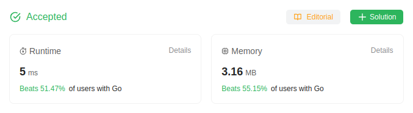

# 125. Valid Palindrome

A phrase is a **palindrome** if, after converting all uppercase letters into lowercase letters and removing all non-alphanumeric characters, it reads the same forward and backward. Alphanumeric characters include letters and numbers.

Given a string `s`, return *`true` if it is a **palindrome**, or `false` otherwise*.

## Example 1:
> **Input**: s = "A man, a plan, a canal: Panama" \
> **Output**: true \
> **Explanation**: "amanaplanacanalpanama" is a palindrome.

## Example 2:
> **Input**: s = "race a car" \
> **Output**: false \
> **Explanation**: "raceacar" is not a palindrome.

## Example 3:
> **Input**: s = " " \
> **Output**: true \
> **Explanation**: s is an empty string "" after removing non-alphanumeric characters. \
> Since an empty string reads the same forward and backward, it is a palindrome.

## Constraints:
* `1 <= s.length <= 2 * 10^5`
* `s` consists only of printable ASCII characters.

## Solution
> **My Solution**
> ```go
> func isPalindrome(s string) bool {
>     str := strings.Builder{}
>     for _,v := range s {
>         if 'a' <= v && v <= 'z' {
>             str.WriteString(string(v))
>         } else if 'A' <= v && v <= 'Z' {
>             str.WriteString(string(v+32))
>         } else if '0' <= v && v <= '9' {
>             str.WriteString(string(v))
>         }
>     }
>     c := str.String()
>     for i := 0; i < len(c); i++ {
>         if c[i]!= c[len(c)-1-i] {
>             return false
>         }
>     }
> 
>     return true
> }
> ```



Leetcode: [link](https://leetcode.com/problems/valid-palindrome/description/)