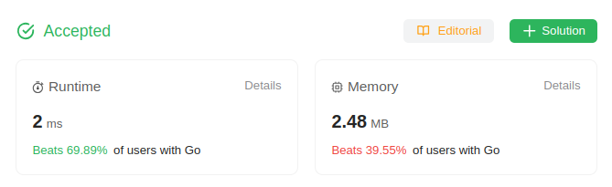

# 1662. Check If Two String Arrays are Equivalent

Given two string arrays `word1` and `word2`, return `true` *if the two arrays **represent** the same string, and `false` otherwise.*

A string is **represented** by an array if the array elements concatenated **in order** forms the string.

## Example 1:
> **Input**: word1 = ["ab", "c"], word2 = ["a", "bc"] \
> **Output**: true \
> **Explanation**: \
> word1 represents string "ab" + "c" -> "abc" \
> word2 represents string "a" + "bc" -> "abc" \
> The strings are the same, so return true.

## Example 2:
> **Input**: word1 = ["a", "cb"], word2 = ["ab", "c"]
> **Output**: false

## Example 3:
> **Input**: word1  = ["abc", "d", "defg"], word2 = ["abcddefg"]
> **Output**: true

## Constraints:
* `1 <= word1.length, word2.length <= 10^3`
* `1 <= word1[i].length, word2[i].length <= 10^3`
* `1 <= sum(word1[i].length), sum(word2[i].length) <= 10^3`
* `word1[i]` and `word2[i]` consist of lowercase letters.

## Hint-1
> Concatenate all strings in the first array into a single string in the given order, the same for the second array.

## Hint-2
> Both arrays represent the same string if and only if the generated strings are the same.

## Solution
> **My Solution**
> ```go
> func arrayStringsAreEqual(word1 []string, word2 []string) bool {
>     s1,s2 := strings.Builder{},strings.Builder{}
> 
>     for _,v := range word1 {
>         s1.WriteString(v)
>     }
> 
>     for _,v := range word2 {
>         s2.WriteString(v)
>     }
> 
>     if s1.String()==s2.String() {
>         return true
>     }
>     return false
> }
> ```



Leetcode: [link](https://leetcode.com/problems/check-if-two-string-arrays-are-equivalent/description)