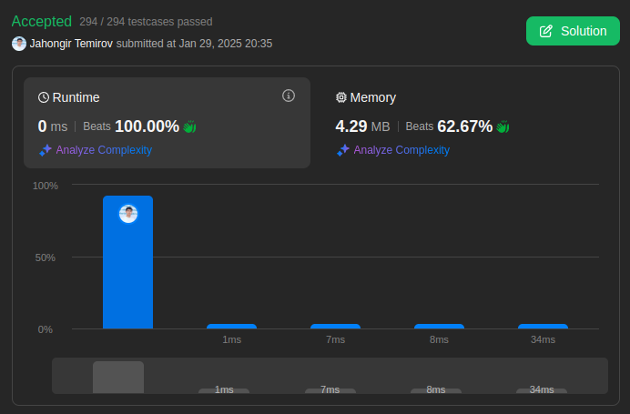

# 1991. Find the Middle Index in Array

🟩 Easy

## Solution

My Solution

```go
func findMiddleIndex(nums []int) int {
    sum := 0
    for _, num := range nums {
        sum += num
    }

    left := 0
    for i, num := range nums {
        sum -= num
        if left == sum {
            return i
        }
        left += num
    }

    return -1
}
```



Leetcode: [link](https://leetcode.com/problems/find-the-middle-index-in-array/)
