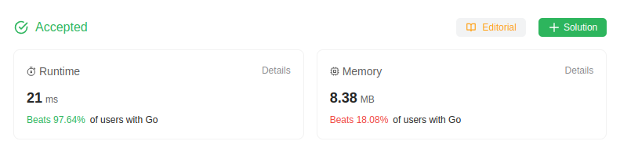

# 209. Minimum Size Subarray Sum
🟧 Medium

Given an array of positive integers `nums` and a positive integer `target`, return *the minimal length of a 
subarray whose sum is greater than or equal to `target`*. If there is no such subarray, return `0` instead.

## Example 1:
> **Input**: target = 7, nums = [2,3,1,2,4,3] \
> **Output**: 2 \
> **Explanation**: The subarray [4,3] has the minimal length under the problem constraint.

## Example 2:
> **Input**: target = 4, nums = [1,4,4] \
> **Output**: 1

## Example 3:
> **Input**: target = 11, nums = [1,1,1,1,1,1,1,1] \
> **Output**: 0
 

## Constraints:

* `1 <= target <= 10^9`
* `1 <= nums.length <= 10^5`
* `1 <= nums[i] <= 10^4`

**Follow up**: If you have figured out the `O(n)` solution, try coding another solution of which the time complexity is `O(n log(n))`.

## Solution
> **My Solution**
> ```go
> func minSubArrayLen(target int, nums []int) int {
> 	l, s := 0, 0
> 
> 	m := math.MaxInt32
> 
> 	for r := 0; r < len(nums); r++ {
> 		s += nums[r]
> 
> 		for s >= target {
> 			m = min(m, r-l+1)
> 			s -= nums[l]
> 			l++
> 		}
> 	}
> 
> 	if m == math.MaxInt32 {
> 		return 0
> 	} else {
> 		return m
> 	}
> }
> ```



Leetcode: [link](https://leetcode.com/problems/minimum-size-subarray-sum/description/)    