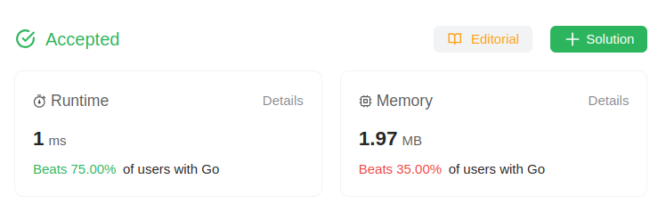

# 2119. A Number After a Double Reversal
🟩 Easy

**Reversing** an integer means to reverse all its digits.

 * For example, reversing `2021` gives `1202`. Reversing `12300` gives `321` as the **leading zeros are not retained.**

Given an integer `num`, **reverse** `num` to get `reversed1`, **then reverse** `reversed1` to get `reversed2`. Return `true` *if `reversed2` equals* `num`. Otherwise return `false`.

## Example 1:
> **Input**: num = 526 \
> **Output**: true \
> **Explanation**: Reverse num to get 625, then reverse 625 to get 526, which equals num.

## Example 2:
> **Input**: num = 1800 \
> **Output**: false \
> **Explanation**: Reverse num to get 81, then reverse 81 to get 18, which does not equal num.

## Example 3:
> **Input**: num = 0 \
> **Output**: true \
> **Explanation**: Reverse num to get 0, then reverse 0 to get 0, which equals num.

## Constraints:

* <code>0 <= num <= 10<sup>6</sup></code>

## Hint-1
> Other than the number 0 itself, any number that ends with 0 would lose some digits permanently when reversed.

## Solution
> **My Solution**
> ```go
> func isSameAfterReversals(num int) bool {
> 	return reverse(reverse(num))==num
> }
> func reverse(num int) int {
> 	sum := 0
> 	for num != 0 {
> 		sum = sum*10 + num%10
> 		num/=10
> 	}
> 	return sum
> }
> ```



Leetcode: [link](https://leetcode.com/problems/a-number-after-a-double-reversal/description/)    