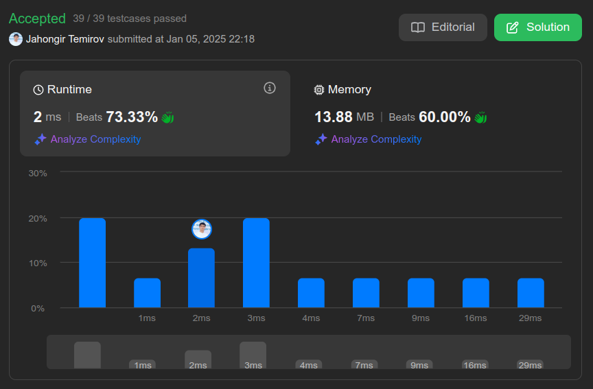

# 2381. Shifting Letters II

🟧 Medium

## Solution

My Solution

```go
func shiftingLetters(s string, shifts [][]int) string {
    nums := make([]int, len(s)+1)
    bytes := []byte(s)
    for _, shift := range shifts {
        if shift[2] == 1 {
            nums[shift[0]]++
            nums[shift[1]+1]--
        } else {
            nums[shift[0]]--
            nums[shift[1]+1]++
        }
    }

    for i:=1; i<len(nums); i++ {
        nums[i]+=nums[i-1]
    }
    
    for i, b := range bytes {
        numberShift := (int(b-'a')+(26+nums[i])%26)%26
        for numberShift < 0 || numberShift > 25 {
            numberShift += 26
            numberShift %= 26
        }
        bytes[i] = byte('a'+byte(numberShift))
    }

    return string(bytes)
}
```



Leetcode: [link](https://leetcode.com/problems/shifting-letters-ii/description)
