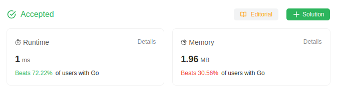

# 2544. Alternating Digit Sum
🟩 Easy

You are given a positive integer `n`. Each digit of `n` has a sign according to the following rules:

* The **most significant digit** is assigned a **positive** sign.
* Each other digit has an opposite sign to its adjacent digits.

Return *the sum of all digits with their corresponding sign.*

## Example 1:
> **Input**: n = 521 \
> **Output**: 4 \
> **Explanation**: (+5) + (-2) + (+1) = 4.

## Example 2:
> **Input**: n = 111 \
> **Output**: 1 \
> **Explanation**: (+1) + (-1) + (+1) = 1.

## Example 3:
> **Input**: n = 886996 \
> **Output**: 0 \
> **Explanation**: (+8) + (-8) + (+6) + (-9) + (+9) + (-6) = 0.

## Constraints:
* `1 <= n <= 10^9`

## Hint-1
> The first step is to loop over the digits. We can convert the integer into a string, an array of digits, or just loop over its digits.

## Hint-2
> Keep a variable sign that initially equals 1 and a variable answer that initially equals 0.

## Hint-3
> Each time you loop over a digit i, add sign * i to answer, then multiply sign by -1.

## Solution
> **My Solution**
> ```go
> func alternateDigitSum(n int) int {
> 	var result int
> 	for ; n != 0; n /= 10 {
> 		result = n%10 - result
> 	}
> 	return result
> }
> ```



Leetcode: [link](https://leetcode.com/problems/alternating-digit-sum/description/)