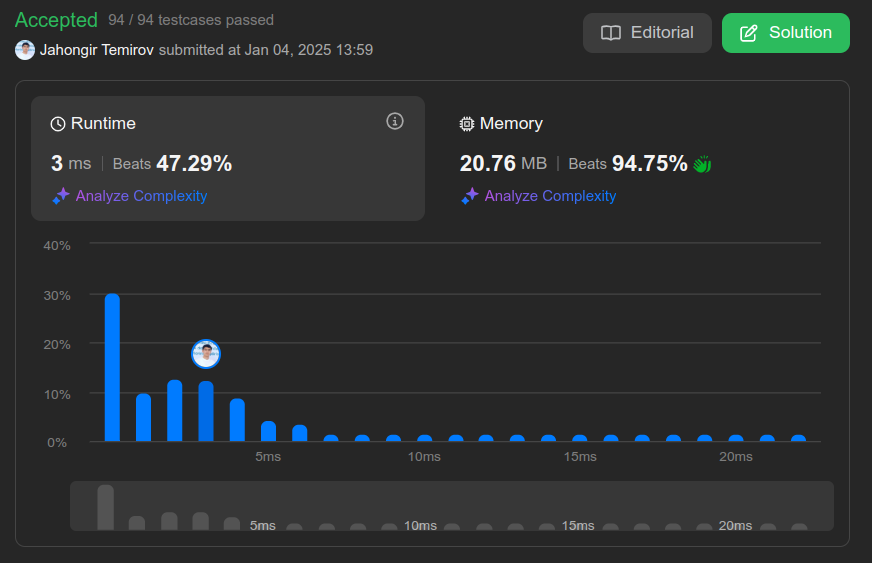

# 2559. Count Vowel Strings in Ranges

🟧 Medium

You are given a **0-indexed** array of strings `words` and a 2D array of integers `queries`.

Each query `queries[i] = [li, ri]` asks us to find the number of strings present in the range `li` to `ri` (both **inclusive**) of `words` that start and end with a vowel.

Return *an array `ans` of size `queries.length`, where `ans[i]` is the answer to the `i^th` query.*

Note that the vowel letters are `'a'`, `'e'`, `'i'`, `'o'`, and `'u'`.

## Example 1

> **Input**: words = ["aba","bcb","ece","aa","e"], queries = [[0,2],[1,4],[1,1]] \
> **Output**: [2,3,0] \
> **Explanation**: The strings starting and ending with a vowel are "aba", "ece", "aa" and "e". \
> The answer to the query [0,2] is 2 (strings "aba" and "ece"). \
> to query [1,4] is 3 (strings "ece", "aa", "e"). \
> to query [1,1] is 0. \
> We return [2,3,0].

## Example 2

> **Input**: words = ["a","e","i"], queries = [[0,2],[0,1],[2,2]] \
> **Output**: [3,2,1] \
> **Explanation**: Every string satisfies the conditions, so we return [3,2,1].

## Constraints

* `1 <= words.length <= 10^5`
* `1 <= words[i].length <= 40`
* `words[i]` consists only of lowercase English letters.
* `sum(words[i].length) <= 3 * 10^5`
* `1 <= queries.length <= 10^5`
* `0 <= li <= ri < words.length`

## Hint 1

> Precompute the prefix sum of strings that start and end with vowels.

## Hint 2

> Use unordered_set to store vowels.

## Hint 3

> Check if the first and last characters of the string are present in the vowels set.

## Hint 4

> Subtract prefix sum for range [l-1, r] to find the number of strings starting and ending with vowels.

## Solution

My Solution

```go
func vowelStrings(words []string, queries [][]int) []int {
    vowels := map[byte]bool{
        'a':true,
        'e':true,
        'i':true,
        'o':true,
        'u':true,
    }
    ans := make([]int, len(queries))
    vowelCounts := make([]int, len(words)+1)

    for i, word := range words {
        if vowels[word[0]] && vowels[word[len(word)-1]] {
            vowelCounts[i+1]++
        }
        vowelCounts[i+1]+=vowelCounts[i]
    }

    for i, query := range queries {
        ans[i] = vowelCounts[query[1]+1]-vowelCounts[query[0]]
    }

    return ans
}
```



Leetcode: [link](https://leetcode.com/problems/count-vowel-strings-in-ranges/description/)
