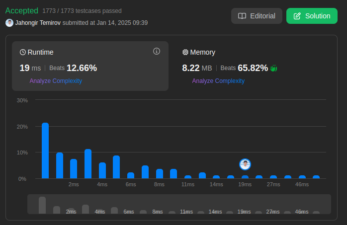

# 2657. Find the Prefix Common Array of Two Arrays

🟧 Medium

## Solution

My Solution-1

```go
func findThePrefixCommonArray(A []int, B []int) []int {
    n := len(A)
    resp := make([]int, n)
    bMap := make(map[int]bool, n)
    aMap := make(map[int]bool, n)

    for i:=0; i<n; i++ {
        aMap[A[i]]=true
        bMap[B[i]]=true

        count := 0
        for k := range aMap {
            if bMap[k] {
                count++
            }
        }
        resp[i]=count
    }
    return resp
}
```


My Solution-2

```go
func findThePrefixCommonArray(A []int, B []int) []int {
    n := len(A)
    resp := make([]int, n)
    freq := make([]int, n+1)
    count := 0
    for i:=0; i<n; i++ {
        freq[A[i]]++
        if freq[A[i]]==2 {count++}

        freq[B[i]]++
        if freq[B[i]]==2 {count++}

        resp[i]=count
    }
    return resp
}
```



Leetcode: [link](https://leetcode.com/problems/find-the-prefix-common-array-of-two-arrays/description/)
