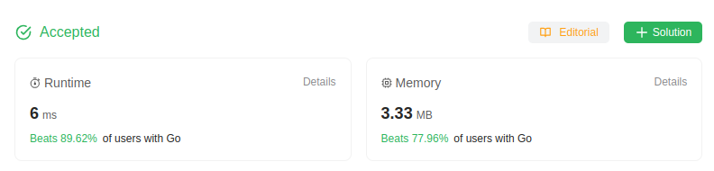

# 300. Longest Increasing Subsequence
🟧 Medium

Given an integer array `nums`, return *the length of the longest **strictly increasing 
subsequence***.

## Example 1:
> **Input**: nums = [10,9,2,5,3,7,101,18] \
> **Output**: 4 \
> **Explanation**: The longest increasing subsequence is [2,3,7,101], therefore the length is 4.

## Example 2:
> **Input**: nums = [0,1,0,3,2,3] \
> **Output**: 4 
## Example 3:
> **Input**: nums = [7,7,7,7,7,7,7] \
> **Output**: 1

## Constraints:
* `1 <= nums.length <= 2500`
* `-10^4 <= nums[i] <= 10^4`

## Follow up:
> Can you come up with an algorithm that runs in O(n log(n)) time complexity?

## Solution
> **My Solution**
> ```go
> func lengthOfLIS(nums []int) int {
>
>     tail := []int{}
>     idx := 0
>     for _, num := range nums {
>         idx = binarySearch(tail, num)
>         if idx == len(tail) {
>             tail = append(tail, num)
>         } else {
>             tail[idx] = num
>         }
>     }
>     return len(tail)
> }
> 
> func binarySearch(tail []int, target int) int {
>     n := len(tail)
>     left, right := 0, n
>     for left < right {
>         mid := left + (right - left) / 2
>         if tail[mid] < target {
>             left = mid+1
>         } else if tail[mid] > target {
>             right = mid
>         } else {
>             return mid
>         }
>     }
>     return left
> }
> ```



Leetcode: [link](https://leetcode.com/problems/longest-increasing-subsequence/description/)