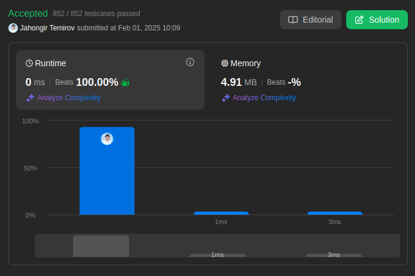

# 3151. Special Array I

🟩 Easy

## Solution

My Solution

```go
func isArraySpecial(nums []int) bool {
    for i:=1; i<len(nums); i++ {
        if nums[i-1] % 2 == nums[i] % 2 {
            return false
        }
    }
    return true
}
```



Leetcode: [link](https://leetcode.com/problems/special-array-i/)
