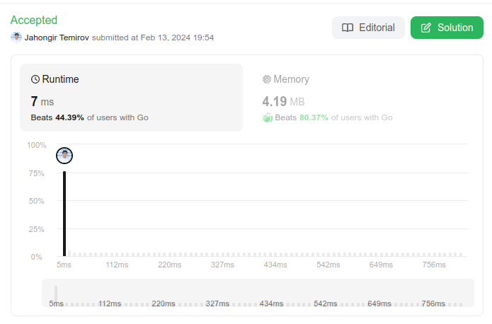

# 345. Reverse Vowels of a String
🟩 Easy

Given a string `s`, reverse only all the vowels in the string and return it.

The vowels are `'a'`, `'e'`, `'i'`, `'o'`, and `'u'`, and they can appear in both lower and upper cases, more than once.

## Example 1:
> **Input**: s = "hello" \
> **Output**: "holle"

## Example 2:
> **Input**: s = "leetcode" \
> **Output**: "leotcede"

## Constraints:
* `1 <= s.length <= 3 * 10^5`
* `s` consist of **printable ASCII** characters.

## Solution
> **My Solution**
> ```go
> func reverseVowels(s string) string {
>     
>     vowels := make([]byte,0, len(s))
>     res := make([]byte,len(s))
>     for _, v :=range s {
>         if isVowel(byte(v)) {
>             vowels = append(vowels,byte(v))
>         }
>     }
>     count := len(vowels)-1
>     for i, v := range s {
>         if isVowel(byte(v)) {
>             res[i]=vowels[count]
>             count--
>         }else {
>             res[i]=byte(s[i])
>         }
>     }
>     return string(res)
> }
> 
> func isVowel(s byte) bool {
>     vowels := []byte{'a','e','u','i','o','A','E','U','I','O'}
> 
>     for _, v:= range vowels{
>         if s == v {
>             return true
>         }
>     }
> 
>     return false
> }
> ```



Leetcode: [link](https://leetcode.com/problems/reverse-vowels-of-a-string/description/)