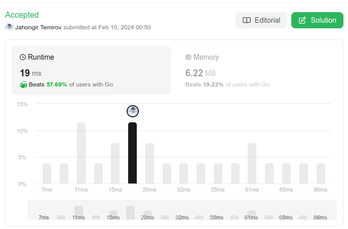

# 368. Largest Divisible Subset
🟧 Medium

Given a set of **distinct** positive integers `nums`, return the largest subset `answer` such that every pair `(answer[i], answer[j])` of elements in this subset satisfies:

* `answer[i] % answer[j] == 0`, or
* `answer[j] % answer[i] == 0`
If there are multiple solutions, return any of them.

## Example 1:
> **Input**: nums = [1,2,3] \
> **Output**: [1,2] \
> **Explanation**: [1,3] is also accepted.

## Example 2:
> **Input**: nums = [1,2,4,8] \
> **Output**: [1,2,4,8]

## Constraints:
* `1 <= nums.length <= 1000`
* `1 <= nums[i] <= 2 * 10^9`
* All the integers in `nums` are **unique**.

## Solution
> **My Solution**
> ```go
> func largestDivisibleSubset(nums []int) []int {
> 	sort.Ints(nums)
> 
> 	n := len(nums)
> 	maxLen, maxInd := 1, 0
> 	dp := make([][]int, n)
> 	for i := range dp {
> 		dp[i] = []int{nums[i]}
> 	}
> 
> 	for i := 0; i < n; i++ {
> 		for j := 0; j < i; j++ {
> 			if nums[i]%nums[j] == 0 {
> 				if len(dp[j])+1 > len(dp[i]) {
> 					dp[i] = append([]int(nil), dp[j]...)
> 					dp[i] = append(dp[i], nums[i])
> 				}
> 				if l := len(dp[i]); l > maxLen {
> 					maxLen = l
> 					maxInd = i
> 				}
> 			}
> 		}
> 	}
> 
> 	return dp[maxInd]
> }
> ```

Follow up: Your algorithm's time complexity must be better than O(n log n), where n is the array's size.



Leetcode: [link](https://leetcode.com/problems/largest-divisible-subset/description/)