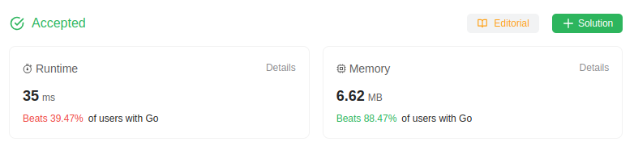

# 485. Max Consecutive Ones

Given a binary array `nums`, return *the maximum number of consecutive `1`'s in the array*.

## Example 1:
> **Input**: nums = [1,1,0,1,1,1] \
> **Output**: 3 \
> **Explanation**: The first two digits or the last three digits are consecutive 1s. The maximum number of consecutive 1s is 3.

## Example 2:
> **Input**: nums = [1,0,1,1,0,1] \
> **Output**: 2
 

## Constraints:
> * `1 <= nums.length <= 10^5`
> * `nums[i] is either 0 or 1.`

## Hint-1
> You need to think about two things as far as any window is concerned. One is the starting point for the window. How do you detect that a new window of 1s has started? The next part is detecting the ending point for this window. How do you detect the ending point for an existing window? If you figure these two things out, you will be able to detect the windows of consecutive ones. All that remains afterward is to find the longest such window and return the size.

## Solution
> **My Solution**
> ```go
> func findMaxConsecutiveOnes(nums []int) int {
>     
>     max := 0
>     min := 0
> 
>     for i:=0; i < len(nums); i++ {
>         if nums[i] == 1 {
>             min++
>         } else {
>             if min > max {
>                 max = min
>             }
>             min = 0
>         }
>     }
>     if min > max {
>         max = min
>     }
>
>     return max
> }
> ```



Leetcode: [link](https://leetcode.com/problems/max-consecutive-ones/description/)