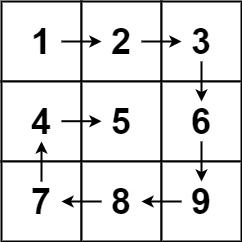
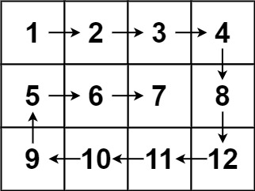

# 54. Spiral Matrix

Given an `m x n` `matrix`, return *all elements of the `matrix` in spiral order*.


## Example 1:



> **Input**: matrix = [[1,2,3],[4,5,6],[7,8,9]] \
> **Output**: [1,2,3,6,9,8,7,4,5]

## Example 2:



> **Input**: matrix = [[1,2,3,4],[5,6,7,8],[9,10,11,12]] \
> **Output**: [1,2,3,4,8,12,11,10,9,5,6,7]
 

## Constraints:

* `m == matrix.length`
* `n == matrix[i].length`
* `1 <= m, n <= 10`
* `-100 <= matrix[i][j] <= 100`

## Solution
> **My Solution**
> ```go
> func spiralOrder(matrix [][]int) []int {
> 	m := len(matrix)
> 	n := len(matrix[0])
> 
> 	res := make([]int, m*n)
> 
> 	l, r, t, b := 0, n-1, 0, m-1
> 
> 	for i := 0; i < m*n; {
> 
> 		// left to rigth step
> 		for j := l; j <= r; j++ {
> 			res[i] = matrix[t][j]
> 			i++
> 		}
> 		t++
> 
> 		if t > b {
> 			break
> 		}
> 
> 		// top to bottom step
> 		for j := t; j <= b; j++ {
> 			res[i] = matrix[j][r]
> 			i++
> 		}
> 		r--
> 
> 		if l > r {
> 			break
> 		}
> 
> 		// right to left step
> 		for j := r; j >= l; j-- {
> 			res[i] = matrix[b][j]
> 			i++
> 		}
> 		b--
> 
> 		// bottom to top step
> 		for j := b; j >= t; j-- {
> 			res[i] = matrix[j][l]
> 			i++
> 		}
> 		l++
> 	}
> 
> 	return res
> }
> ```

Leetcode: [link](https://leetcode.com/problems/spiral-matrix/description/)