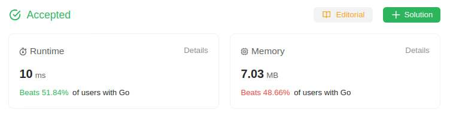

# 557. Reverse Words in a String III

Given a string `s`, reverse the order of characters in each word within a sentence while still preserving whitespace and initial word order.

## Example 1:
> **Input**: s = "Let's take LeetCode contest" \
> **Output**: "s'teL ekat edoCteeL tsetnoc"

## Example 2:
> **Input**: s = "Mr Ding" \
> **Output**: "rM gniD"

Constraints:
* `1 <= s.length <= 5 * 10^4`
* `s` contains printable **ASCII** characters.
* `s` does not contain any leading or trailing spaces.
* There is **at least one** word in `s`.
* All the words in `s` are separated by a single space.

## Solution
> **My Solution**
> ```go
> func reverseWords(s string) string {
> 	arr := strings.Split(s, " ")
> 	var result strings.Builder
> 	for _, v := range arr {
> 
> 		if v != "" {
> 			result.WriteString(reverse(v) + " ")
> 		}
> 	}
> 
> 	return strings.TrimSpace(result.String())
> }
> 
> func reverse(s string) string {
> 	var result strings.Builder
> 	for i := len(s) - 1; i >= 0; i-- {
> 		result.WriteByte(s[i])
> 	}
> 	return result.String()
> }
> ```



Leetcode: [link](https://leetcode.com/problems/reverse-words-in-a-string-iii/description/)