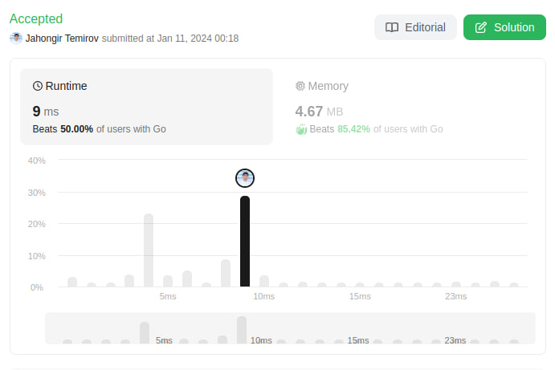

# 905. Sort Array By Parity
🟩 Easy

Given an integer array `nums`, move all the even integers at the beginning of the array followed by all the odd integers.

Return ***any array** that satisfies this condition*.

## Example 1:
> **Input**: nums = [3,1,2,4] \
> **Output**: [2,4,3,1] \
> **Explanation**: The outputs [4,2,3,1], [2,4,1,3], and [4,2,1,3] would also be accepted.

## Example 2:
> **Input**: nums = [0] \
> **Output**: [0]

## Constraints:
* `1 <= nums.length <= 5000`
* `0 <= nums[i] <= 5000`

## Solution
> **My Solution**
> ```go
> func sortArrayByParity(nums []int) []int {
>     k := 0
> 
>     for i := 0; i < len(nums); i++ {
>         if nums[i] % 2 == 0 {
>             nums[k],nums[i]=nums[i],nums[k]
>             k++
>         }
>     }
> 
>     return nums
> }
> ```



Leetcode: [link](https://leetcode.com/problems/sort-array-by-parity/description/)