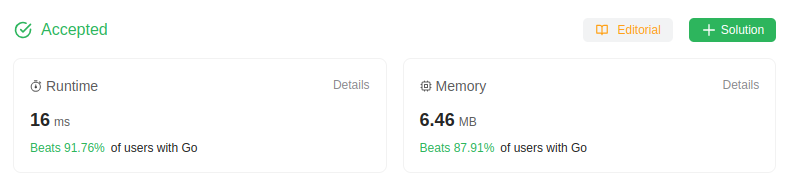

# 941. Valid Mountain Array
🟩 Easy

Given an array of integers `arr`, return *`true` if and only if it is a valid mountain array*.

Recall that arr is a mountain array if and only if:

* arr.length >= 3
* There exists some i with 0 < i < arr.length - 1 such that:
    * arr[0] < arr[1] < ... < arr[i - 1] < arr[i] 
    * arr[i] > arr[i + 1] > ... > arr[arr.length - 1]


## Example 1:
> **Input**: arr = [2,1] \
> **Output**: false

## Example 2:
> **Input**: arr = [3,5,5] \
> **Output**: false

## Example 3:
> **Input**: arr = [0,3,2,1] \
> **Output**: true

## Constraints:
* `1 <= arr.length <= 10^4`
* `0 <= arr[i] <= 10^4`

## Hint-1
> It's very easy to keep track of a monotonically increasing or decreasing ordering of elements. You just need to be able to determine the start of the valley in the mountain and from that point onwards, it should be a valley i.e. no mini-hills after that. Use this information in regards to the values in the array and you will be able to come up with a straightforward solution.

## Solution
> **My Solution**
> ```go
> func validMountainArray(arr []int) bool {
>     down,up := false,false
> 
>     if len(arr) < 3 {
>         return false
>     }
> 
>     if arr[0] < arr[1] {
>         up = true
>     } else  {
>         return false
>     }
> 
>     for i:=1; i < len(arr); i++ {
>         if up {
>             if arr[i-1] < arr[i] {
>                 up=true
>                 down=false
>             } else if arr[i-1] == arr[i] {
>                 return false
>             } else {
>                 up=false
>                 down=true
>             }
>         } else if down {
>             if arr[i-1] > arr[i] {
>                 up=false
>                 down=true
>             } else {
>                 return false
>             }
>         } else {
>             return false
>         }
>     }
>     if down {
>         return true
>     } else {
>         return false
>     }
> }
> ```



Leetcode: [link](https://leetcode.com/problems/valid-mountain-array/description/)